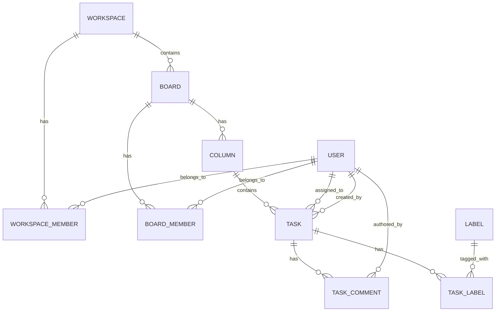
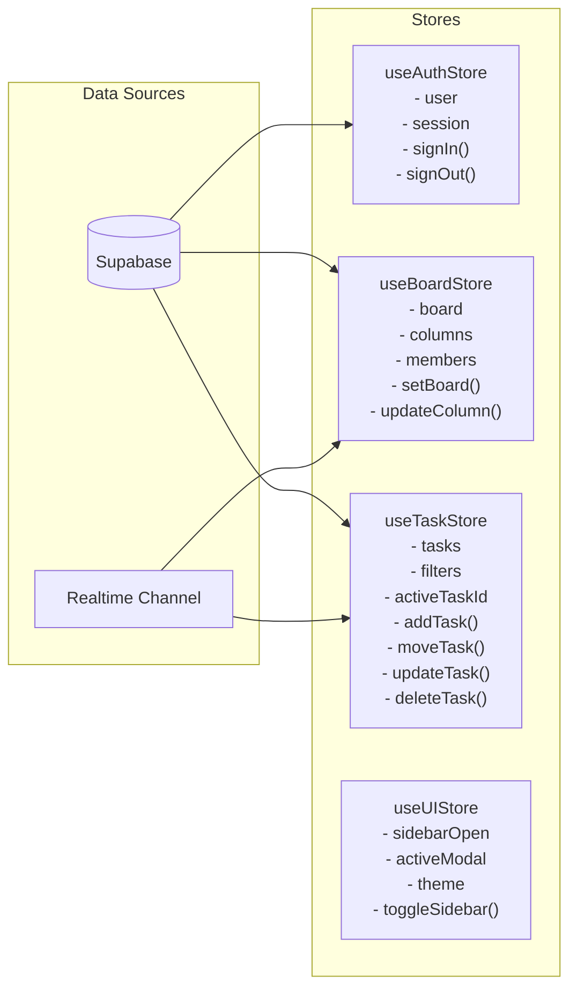

# O2 Kanban -- Revisao Arquitetural Completa

> **Autor:** Aria (System Architect Agent)
> **Data:** 2026-02-20
> **Versao:** 1.0
> **Status:** Phase 0 -- Assessment (Brownfield Enhancement)

---

## Indice

1. [Assessment da Arquitetura Atual](#1-assessment-da-arquitetura-atual)
2. [Recomendacoes de Stack](#2-recomendacoes-de-stack)
3. [Proposta de Arquitetura](#3-proposta-de-arquitetura)
4. [Modelo de Dados](#4-modelo-de-dados)
5. [API Design](#5-api-design)
6. [Diagrama de Componentes](#6-diagrama-de-componentes)
7. [Decision Log](#7-decision-log)

---

## 1. Assessment da Arquitetura Atual

### 1.1 Visao Geral

O O2 Kanban e uma aplicacao Next.js 16 (App Router) que implementa um quadro Kanban com drag-and-drop via `@dnd-kit`. O projeto esta em estagio de prototipo funcional -- a UI existe e o DnD funciona, mas nao ha persistencia, autenticacao, nem separacao de responsabilidades.

### 1.2 Inventario de Arquivos

| Arquivo | Linhas | Responsabilidade |
|---------|--------|-----------------|
| `src/app/page.js` | 233 | Pagina principal: estado, DnD, colunas hardcoded, polling, layout |
| `src/app/layout.js` | 21 | Root layout (Inter font, lang pt-BR, dark mode) |
| `src/app/api/slack-webhook/route.js` | 42 | API route unica: POST (recebe de Slack) + GET (retorna tasks in-memory) |
| `src/components/Kanban/Board.js` | 42 | Header com avatares hardcoded, botoes sem funcionalidade |
| `src/components/Kanban/Card.js` | 91 | Card sortable com tipo, tags, assignee |
| `src/components/Kanban/Column.js` | 47 | Coluna droppable com contagem |
| `src/components/Kanban/Sidebar.js` | 34 | Sidebar com 3 links sem navegacao real |
| `src/app/globals.css` | 122 | Design tokens (cores, espacamento, layout) |
| `src/app/kanban.css` | 594 | Todos os estilos de componentes |

**Total de codigo fonte:** ~1.226 linhas (JS + CSS)

### 1.3 O Que Funciona

- **Drag-and-drop funcional:** @dnd-kit implementado corretamente com `DndContext`, `SortableContext`, `DragOverlay`, sensores (Pointer + Keyboard) e estrategia `closestCorners`.
- **UI visual coerente:** Design system com tokens CSS bem definidos (cores, espacamento, radius, shadows). Dark mode consistente. Responsividade basica (tablet/mobile via media queries).
- **Estrutura de componentes razoavel:** Separacao em Board, Column, Card, Sidebar. Componentes relativamente puros.
- **Acessibilidade basica:** Atributos `role`, `aria-label`, `aria-current` presentes. Focus visible com outline.
- **Internacionalizacao parcial:** Labels em PT-BR nos componentes (typeLabels, tagLabels). `lang="pt-BR"` no HTML.
- **React Compiler habilitado:** `reactCompiler: true` no next.config.mjs com babel-plugin-react-compiler -- otimizacao automatica de re-renders.

### 1.4 Dividas Tecnicas Criticas

#### DT-01: Zero Persistencia
- **Severidade:** CRITICA
- **Descricao:** Todo o estado vive em `useState` no client-side (`page.js` linha 73). A API route usa `let mockDatabaseTasks = []` -- array in-memory que reseta a cada deploy/restart. Nenhum dado sobrevive a um refresh de pagina.
- **Impacto:** A aplicacao e inutilizavel em producao. Qualquer interacao (mover cards, criar tasks) e perdida.

#### DT-02: God Component (page.js)
- **Severidade:** ALTA
- **Descricao:** `page.js` concentra 233 linhas com: definicao de colunas, mock de tasks, estado global, logica de DnD (dragStart, dragOver, dragEnd), polling de API, controle de hydration, e layout. Viola Single Responsibility Principle.
- **Impacto:** Dificil de testar, manter e estender. Qualquer nova feature aumenta a complexidade deste arquivo.

#### DT-03: Dados Hardcoded
- **Severidade:** ALTA
- **Descricao:** Colunas definidas como `const initialColumns` em `page.js`. Avatares hardcoded em `Board.js` (Matheus, Andrey, Felipe, Caio). Tasks mock inline. Titulo "Oxy" fixo.
- **Impacto:** Impossivel ter multiplos boards, configurar colunas dinamicamente, ou gerenciar usuarios.

#### DT-04: API Route Inadequada
- **Severidade:** ALTA
- **Descricao:** Uma unica route (`/api/slack-webhook`) faz POST e GET. O GET retorna todas as tasks in-memory sem paginacao/filtro. O POST aceita qualquer payload com `text` e `user_name` sem autenticacao. Nao ha verificacao de assinatura do Slack.
- **Impacto:** Risco de seguranca (qualquer um pode enviar POST). Sem estrutura para CRUD real. Sem separacao entre webhook de Slack e API REST do kanban.

#### DT-05: Polling Ineficiente
- **Severidade:** MEDIA
- **Descricao:** `setInterval` de 5 segundos fazendo GET na API (`page.js` linhas 76-97). Sem abort controller, sem error boundary, sem backoff em caso de erro.
- **Impacto:** Requisicoes desnecessarias mesmo quando nao ha mudancas. Potencial memory leak se componente desmontar incorretamente (embora clearInterval esteja presente).

#### DT-06: Sem Autenticacao/Autorizacao
- **Severidade:** ALTA
- **Descricao:** Nenhum sistema de auth. Qualquer pessoa com a URL acessa o board. A API nao valida identidade.
- **Impacto:** Inviavel para uso em equipe real. Sem conceito de quem e o usuario logado.

#### DT-07: CSS Monolitico
- **Severidade:** BAIXA
- **Descricao:** `kanban.css` tem 594 linhas com todos os estilos. Nao usa CSS Modules, styled-components ou Tailwind. Classes globais com risco de colisao.
- **Impacto:** Escalabilidade limitada. Ao adicionar mais paginas/features, colisoes de nomes se tornam provaveis.

#### DT-08: Sidebar e Header Sem Funcionalidade
- **Severidade:** BAIXA
- **Descricao:** Botoes de filtro, notificacao, layout grid, collapse, e links de navegacao nao fazem nada. Sao apenas visuais.
- **Impacto:** UX enganosa -- usuario vê botoes que nao funcionam.

#### DT-09: Logica de DnD Fragil
- **Severidade:** MEDIA
- **Descricao:** `handleDragOver` e `handleDragEnd` verificam `active.data.current?.type` contra strings "Task" ou "Card". O Card.js registra `type: "Card"` no sortable data, mas o check procura por ambos. Logica de reordenamento por splice pode gerar inconsistencias com drag rapido.
- **Impacto:** Bugs sutis de reordenamento. O estado pode dessincronizar se o usuario arrastar rapidamente entre colunas.

#### DT-10: Sem Testes
- **Severidade:** ALTA
- **Descricao:** Nenhum teste unitario, de integracao ou e2e. Nenhuma configuracao de testing framework.
- **Impacto:** Impossivel refatorar com confianca. Regressoes silenciosas.

### 1.5 Metricas de Complexidade

| Metrica | Valor | Avaliacao |
|---------|-------|-----------|
| Componentes React | 5 (Page, Board, Column, Card, Sidebar) | Baixa complexidade |
| API Routes | 1 | Insuficiente |
| Linhas de JS | ~470 | Gerenciavel |
| Linhas de CSS | ~716 | Grande para escopo atual |
| Dependencias runtime | 6 (next, react, react-dom, @dnd-kit x3, lucide-react) | Enxuto |
| Cobertura de testes | 0% | Critico |

---

## 2. Recomendacoes de Stack

### 2.1 O Que Manter

| Tecnologia | Motivo |
|------------|--------|
| **Next.js 16 (App Router)** | Framework maduro, SSR/SSG, API routes, otimizacoes. Versao atual. |
| **React 19** | Ultima versao estavel, React Compiler ja habilitado. |
| **@dnd-kit** | Melhor lib de DnD para React. Acessivel, performatica, bem mantida. |
| **lucide-react** | Icones leves, tree-shakeable, boa cobertura. |
| **CSS Custom Properties** | Design tokens ja definidos em globals.css -- base solida. |
| **React Compiler** | Ja configurado (next.config.mjs + babel plugin). Otimizacao automatica. |

### 2.2 O Que Adicionar

#### 2.2.1 Persistencia: Supabase

**Recomendacao:** Supabase (PostgreSQL + Auth + Realtime + Storage)

**Alternativas consideradas:**
| Opcao | Pros | Contras | Decisao |
|-------|------|---------|---------|
| **Supabase** | PostgreSQL real, auth integrada, realtime (substitui polling), SDK JS excelente, free tier generoso, Row Level Security | Vendor lock-in parcial, curva de aprendizado RLS | **ESCOLHIDO** |
| **Firebase/Firestore** | Realtime nativo, SDK maduro | NoSQL (schema fragil), pricing imprevisivel, Google lock-in | Rejeitado |
| **Prisma + PostgreSQL (self-hosted)** | Controle total, ORM tipado | Mais setup, sem auth/realtime integrado, mais infra | Rejeitado (complexidade) |
| **localStorage + JSON** | Zero infra, funciona offline | Sem multi-user, sem sync, nao escala | Rejeitado |

**Justificativa:** Supabase oferece o melhor custo-beneficio para o estagio do projeto. PostgreSQL real (migravel), auth pronta (Slack OAuth possivel), e realtime que elimina o polling de 5s. O free tier suporta ate 500MB de banco e 50.000 MAUs.

#### 2.2.2 State Management: Zustand

**Recomendacao:** Zustand

**Alternativas consideradas:**
| Opcao | Pros | Contras | Decisao |
|-------|------|---------|---------|
| **Zustand** | API minimalista, sem boilerplate, middleware (persist, devtools), 1KB, funciona com React 19 | Menos estruturado que Redux | **ESCOLHIDO** |
| **Context API + useReducer** | Nativo do React, zero deps | Re-renders desnecessarios, nao escala, boilerplate | Rejeitado |
| **Redux Toolkit** | Robusto, devtools, community | Overengineering para este escopo, muito boilerplate | Rejeitado |
| **Jotai** | Atomico, leve | Menos intuitivo para state complexo (board + tasks + DnD) | Rejeitado |

**Justificativa:** Zustand resolve o problema do "god component" em `page.js` com stores separados (boardStore, taskStore, uiStore). A API `create()` e simples e o middleware `persist` pode cachear estado no localStorage como fallback offline. Integra naturalmente com o React Compiler.

#### 2.2.3 CSS: CSS Modules (nativo Next.js)

**Recomendacao:** Migrar para CSS Modules progressivamente

**Alternativas consideradas:**
| Opcao | Pros | Contras | Decisao |
|-------|------|---------|---------|
| **CSS Modules** | Nativo no Next.js, zero config, escopo local automatico, reutiliza tokens existentes | Menos DX que Tailwind | **ESCOLHIDO** |
| **Tailwind CSS** | Rapid prototyping, utility-first | Requer reescrever toda a UI, curva de aprendizado, "class soup" | Rejeitado (custo migracaoo) |
| **styled-components** | CSS-in-JS, dinamico | Performance SSR, runtime cost, conflita com React Compiler | Rejeitado |
| **Manter CSS global** | Zero esforco | Colisoes de nomes, nao escala | Rejeitado |

**Justificativa:** CSS Modules aproveita os tokens CSS ja existentes em globals.css e adiciona escopo local sem nenhuma dependencia extra. A migracao e incremental -- cada componente pode migrar independentemente.

#### 2.2.4 Validacao: Zod

**Recomendacao:** Zod para validacao de API e formularios

**Justificativa:** Leve (~13KB), TypeScript-first (mesmo sem TS, valida em runtime), integra com Supabase e server actions do Next.js.

#### 2.2.5 Testes: Vitest + Testing Library + Playwright

**Recomendacao:**
- **Vitest** para unit/integration (compativel com Next.js, rapido)
- **@testing-library/react** para testes de componentes
- **Playwright** para E2E

### 2.3 Stack Consolidada

```
RUNTIME           PERSISTENCIA       STATE           UI/STYLE         QUALIDADE
---------         ------------       -----           --------         ---------
Next.js 16        Supabase           Zustand         CSS Modules      Vitest
React 19          (PostgreSQL)       (stores)        (scoped)         Testing Library
@dnd-kit          (Auth)             (middleware)    lucide-react     Playwright
                  (Realtime)                         CSS Tokens       Zod
                  (RLS)                                               ESLint (ja tem)
```

---

## 3. Proposta de Arquitetura

### 3.1 Principios Arquiteturais

1. **Feature-based organization:** Agrupar por dominio, nao por tipo tecnico.
2. **Separacao de camadas:** UI (components) / Logica (hooks + stores) / Dados (lib + api).
3. **Composicao sobre heranca:** Componentes compostos, sem hierarquias profundas.
4. **Server-first:** Usar Server Components onde possivel, "use client" apenas quando necessario.
5. **Progressive enhancement:** Funcionar sem JS quando viavel (SSR do Next.js).

### 3.2 Nova Estrutura de Pastas

```
src/
├── app/                              # Next.js App Router (rotas e layouts)
│   ├── layout.js                     # Root layout (providers, fonts, metadata)
│   ├── page.js                       # Landing/redirect para /boards
│   ├── globals.css                   # Design tokens (mantido)
│   │
│   ├── (auth)/                       # Route group: auth
│   │   ├── login/page.js
│   │   └── callback/page.js          # OAuth callback (Supabase Auth)
│   │
│   ├── (dashboard)/                  # Route group: app autenticado
│   │   ├── layout.js                 # Layout com Sidebar + auth guard
│   │   ├── boards/
│   │   │   ├── page.js               # Lista de boards do usuario
│   │   │   └── [boardId]/
│   │   │       ├── page.js            # Board Kanban (view principal)
│   │   │       └── settings/page.js   # Config do board
│   │   └── settings/
│   │       └── page.js               # Config do usuario/workspace
│   │
│   └── api/                          # API Routes
│       ├── webhooks/
│       │   └── slack/route.js         # Webhook Slack (POST apenas, com verificacao)
│       ├── boards/
│       │   ├── route.js               # GET (list) / POST (create)
│       │   └── [boardId]/
│       │       ├── route.js           # GET / PATCH / DELETE
│       │       ├── columns/route.js   # GET / POST
│       │       └── tasks/
│       │           ├── route.js       # GET (list) / POST (create)
│       │           └── [taskId]/
│       │               └── route.js   # GET / PATCH / DELETE
│       └── users/
│           └── route.js               # GET (list members)
│
├── components/                       # Componentes reutilizaveis (UI pura)
│   ├── ui/                           # Componentes genericos (design system)
│   │   ├── Avatar.js
│   │   ├── Avatar.module.css
│   │   ├── Button.js
│   │   ├── Button.module.css
│   │   ├── Badge.js
│   │   ├── Dialog.js
│   │   └── DropdownMenu.js
│   │
│   └── kanban/                       # Componentes do dominio Kanban
│       ├── Board.js                  # Board container (sem dados hardcoded)
│       ├── Board.module.css
│       ├── Column.js                 # Coluna droppable
│       ├── Column.module.css
│       ├── Card.js                   # Card sortable
│       ├── Card.module.css
│       ├── CardDetail.js             # Modal de detalhes do card
│       ├── CardDetail.module.css
│       ├── NewTaskForm.js            # Form para criar task
│       ├── Sidebar.js                # Nav sidebar (dinamica)
│       ├── Sidebar.module.css
│       ├── BoardHeader.js            # Header com membros dinamicos
│       ├── BoardHeader.module.css
│       └── DndProvider.js            # Wrapper do DndContext + sensores + logica
│
├── stores/                           # Zustand stores
│   ├── useBoardStore.js              # Board ativo, colunas, metadata
│   ├── useTaskStore.js               # Tasks CRUD, drag state, filtros
│   ├── useAuthStore.js               # Usuario logado, session
│   └── useUIStore.js                 # Sidebar collapsed, modais, theme
│
├── hooks/                            # Custom hooks
│   ├── useSupabase.js                # Supabase client singleton
│   ├── useRealtimeTasks.js           # Subscription Supabase Realtime (substitui polling)
│   ├── useBoard.js                   # Fetch + cache do board ativo
│   ├── useDragAndDrop.js             # Logica DnD extraida de page.js
│   └── useAuth.js                    # Auth state + helpers
│
├── lib/                              # Utilitarios e config
│   ├── supabase/
│   │   ├── client.js                 # createBrowserClient (client-side)
│   │   ├── server.js                 # createServerClient (server-side)
│   │   └── middleware.js             # Auth middleware para Next.js
│   ├── constants.js                  # Enums, defaults, config
│   ├── validators.js                 # Schemas Zod
│   └── utils.js                      # Helpers puros
│
└── types/                            # JSDoc typedefs (sem TypeScript)
    └── index.js                      # @typedef para Board, Column, Task, User
```

### 3.3 Data Flow

```
[Supabase DB] <──realtime──> [Supabase Client]
       │                            │
       │                     [Zustand Stores]
       │                       │         │
       │               [useTaskStore] [useBoardStore]
       │                       │         │
       │                    [Hooks]      │
       │                       │         │
       │                 [Components]    │
       │                    Board ──── Column ──── Card
       │                                              │
       │                                         [DnD Events]
       │                                              │
       │                                       [useDragAndDrop]
       │                                              │
       │                                       [useTaskStore.moveTask()]
       │                                              │
       └──────────── [Supabase UPDATE] ──────────────┘
```

**Fluxo de uma acao (mover card):**
1. Usuario arrasta card de "A Fazer" para "Em Progresso"
2. `DndProvider` dispara `onDragEnd`
3. `useDragAndDrop` hook processa o evento
4. Chama `useTaskStore.moveTask(taskId, newColumnId, newPosition)`
5. Store atualiza estado local (otimistic update)
6. Store chama Supabase `update` na tabela `tasks`
7. Supabase Realtime broadcast a mudanca
8. Outros clientes conectados recebem o update via subscription

### 3.4 Padroes de Componentes

**Server Components (default):**
- Layout pages
- Board list page
- Settings pages

**Client Components ("use client"):**
- `DndProvider.js` -- requer event handlers
- `Card.js` -- usa useSortable
- `Column.js` -- usa useDroppable
- `Sidebar.js` -- interatividade (collapse, active state)
- `BoardHeader.js` -- interatividade
- `NewTaskForm.js` -- formulario

**Composicao exemplo:**
```jsx
// app/(dashboard)/boards/[boardId]/page.js (Server Component)
export default async function BoardPage({ params }) {
  const board = await getBoard(params.boardId);     // Server-side fetch
  const columns = await getColumns(params.boardId);
  const tasks = await getTasks(params.boardId);

  return (
    <BoardHydrator board={board} columns={columns} tasks={tasks}>
      <DndProvider>
        <BoardHeader board={board} />
        <Board>
          {columns.map(col => (
            <Column key={col.id} column={col} />
          ))}
        </Board>
      </DndProvider>
    </BoardHydrator>
  );
}
```

---

## 4. Modelo de Dados

### 4.1 Diagrama Entidade-Relacionamento



### 4.2 Entidades

#### 4.2.1 User

| Campo | Tipo | Restricoes | Descricao |
|-------|------|------------|-----------|
| `id` | UUID | PK, default gen_random_uuid() | ID unico (Supabase Auth) |
| `email` | VARCHAR(255) | UNIQUE, NOT NULL | Email do usuario |
| `display_name` | VARCHAR(100) | NOT NULL | Nome exibido |
| `avatar_url` | TEXT | NULLABLE | URL do avatar |
| `slack_user_id` | VARCHAR(50) | UNIQUE, NULLABLE | ID do Slack (para integracao) |
| `created_at` | TIMESTAMPTZ | NOT NULL, default now() | Data de criacao |
| `updated_at` | TIMESTAMPTZ | NOT NULL, default now() | Ultima atualizacao |

#### 4.2.2 Workspace

| Campo | Tipo | Restricoes | Descricao |
|-------|------|------------|-----------|
| `id` | UUID | PK, default gen_random_uuid() | ID unico |
| `name` | VARCHAR(100) | NOT NULL | Nome do workspace (ex: "O2 Inc") |
| `slug` | VARCHAR(100) | UNIQUE, NOT NULL | Slug URL-friendly |
| `slack_team_id` | VARCHAR(50) | UNIQUE, NULLABLE | Team ID do Slack |
| `created_at` | TIMESTAMPTZ | NOT NULL, default now() | Data de criacao |
| `owner_id` | UUID | FK -> users.id, NOT NULL | Dono do workspace |

#### 4.2.3 Board

| Campo | Tipo | Restricoes | Descricao |
|-------|------|------------|-----------|
| `id` | UUID | PK, default gen_random_uuid() | ID unico |
| `workspace_id` | UUID | FK -> workspaces.id, NOT NULL | Workspace pai |
| `title` | VARCHAR(200) | NOT NULL | Nome do board (ex: "Oxy") |
| `description` | TEXT | NULLABLE | Descricao do board |
| `is_archived` | BOOLEAN | NOT NULL, default false | Se foi arquivado |
| `created_by` | UUID | FK -> users.id, NOT NULL | Quem criou |
| `created_at` | TIMESTAMPTZ | NOT NULL, default now() | Data de criacao |
| `updated_at` | TIMESTAMPTZ | NOT NULL, default now() | Ultima atualizacao |

#### 4.2.4 Column

| Campo | Tipo | Restricoes | Descricao |
|-------|------|------------|-----------|
| `id` | UUID | PK, default gen_random_uuid() | ID unico |
| `board_id` | UUID | FK -> boards.id, NOT NULL, ON DELETE CASCADE | Board pai |
| `title` | VARCHAR(100) | NOT NULL | Nome da coluna |
| `position` | INTEGER | NOT NULL | Ordem da coluna (0-based) |
| `color` | VARCHAR(20) | NOT NULL, default 'neutral' | Chave de cor (mapeia para CSS token) |
| `wip_limit` | INTEGER | NULLABLE | Limite WIP (Work In Progress) |
| `is_done_column` | BOOLEAN | NOT NULL, default false | Marca coluna como "concluido" |
| `created_at` | TIMESTAMPTZ | NOT NULL, default now() | Data de criacao |

**Index:** UNIQUE(board_id, position)

#### 4.2.5 Task

| Campo | Tipo | Restricoes | Descricao |
|-------|------|------------|-----------|
| `id` | UUID | PK, default gen_random_uuid() | ID unico |
| `column_id` | UUID | FK -> columns.id, NOT NULL, ON DELETE CASCADE | Coluna atual |
| `board_id` | UUID | FK -> boards.id, NOT NULL, ON DELETE CASCADE | Board (denormalized para queries) |
| `title` | VARCHAR(500) | NOT NULL | Titulo da task |
| `description` | TEXT | NULLABLE | Descricao detalhada (Markdown) |
| `type` | VARCHAR(20) | NOT NULL, default 'task' | Enum: task, user_story, bug, epic, spike |
| `priority` | VARCHAR(10) | NOT NULL, default 'medium' | Enum: low, medium, high, urgent |
| `position` | FLOAT | NOT NULL | Posicao na coluna (float para insercao sem reordenamento) |
| `assignee_id` | UUID | FK -> users.id, NULLABLE | Responsavel |
| `created_by` | UUID | FK -> users.id, NOT NULL | Criador |
| `due_date` | DATE | NULLABLE | Data limite |
| `slack_message_ts` | VARCHAR(50) | NULLABLE | Timestamp da mensagem Slack (rastreabilidade) |
| `created_at` | TIMESTAMPTZ | NOT NULL, default now() | Data de criacao |
| `updated_at` | TIMESTAMPTZ | NOT NULL, default now() | Ultima atualizacao |

**Indexes:**
- `idx_tasks_column_position` ON (column_id, position)
- `idx_tasks_board` ON (board_id)
- `idx_tasks_assignee` ON (assignee_id)

**Nota sobre `position` como FLOAT:** Usar float permite inserir um card entre dois existentes sem reordenar todos. Exemplo: cards nas posicoes 1.0, 2.0, 3.0 -- inserir entre 1 e 2 = posicao 1.5. Rebalanceamento periodico quando a precisao ficar muito baixa.

#### 4.2.6 Label

| Campo | Tipo | Restricoes | Descricao |
|-------|------|------------|-----------|
| `id` | UUID | PK, default gen_random_uuid() | ID unico |
| `board_id` | UUID | FK -> boards.id, NOT NULL, ON DELETE CASCADE | Board ao qual pertence |
| `name` | VARCHAR(50) | NOT NULL | Nome da label |
| `color` | VARCHAR(20) | NOT NULL | Cor da label |

**Index:** UNIQUE(board_id, name)

#### 4.2.7 TaskLabel (tabela de juncao)

| Campo | Tipo | Restricoes | Descricao |
|-------|------|------------|-----------|
| `task_id` | UUID | FK -> tasks.id, ON DELETE CASCADE | Task |
| `label_id` | UUID | FK -> labels.id, ON DELETE CASCADE | Label |

**PK:** (task_id, label_id)

#### 4.2.8 TaskComment

| Campo | Tipo | Restricoes | Descricao |
|-------|------|------------|-----------|
| `id` | UUID | PK, default gen_random_uuid() | ID unico |
| `task_id` | UUID | FK -> tasks.id, NOT NULL, ON DELETE CASCADE | Task pai |
| `author_id` | UUID | FK -> users.id, NOT NULL | Autor |
| `content` | TEXT | NOT NULL | Conteudo do comentario |
| `slack_message_ts` | VARCHAR(50) | NULLABLE | Ref para mensagem Slack |
| `created_at` | TIMESTAMPTZ | NOT NULL, default now() | Data de criacao |
| `updated_at` | TIMESTAMPTZ | NOT NULL, default now() | Ultima atualizacao |

#### 4.2.9 WorkspaceMember

| Campo | Tipo | Restricoes | Descricao |
|-------|------|------------|-----------|
| `workspace_id` | UUID | FK -> workspaces.id, ON DELETE CASCADE | Workspace |
| `user_id` | UUID | FK -> users.id, ON DELETE CASCADE | Usuario |
| `role` | VARCHAR(20) | NOT NULL, default 'member' | Enum: owner, admin, member |
| `joined_at` | TIMESTAMPTZ | NOT NULL, default now() | Data de entrada |

**PK:** (workspace_id, user_id)

#### 4.2.10 BoardMember

| Campo | Tipo | Restricoes | Descricao |
|-------|------|------------|-----------|
| `board_id` | UUID | FK -> boards.id, ON DELETE CASCADE | Board |
| `user_id` | UUID | FK -> users.id, ON DELETE CASCADE | Usuario |
| `role` | VARCHAR(20) | NOT NULL, default 'member' | Enum: admin, member, viewer |
| `joined_at` | TIMESTAMPTZ | NOT NULL, default now() | Data de entrada |

**PK:** (board_id, user_id)

### 4.3 SQL de Criacao (Supabase Migration)

```sql
-- Ordem de criacao respeitando FKs:
-- 1. users (gerenciado pelo Supabase Auth, extendemos com profile)
-- 2. workspaces
-- 3. workspace_members
-- 4. boards
-- 5. board_members
-- 6. columns
-- 7. tasks
-- 8. labels
-- 9. task_labels
-- 10. task_comments
```

---

## 5. API Design

### 5.1 Convencoes

- **Base path:** `/api`
- **Formato:** JSON
- **Autenticacao:** Supabase Auth JWT via cookie (gerenciado pelo middleware Next.js)
- **Erros:** `{ error: string, code: string, details?: any }`
- **Paginacao:** `?page=1&limit=20` com response `{ data: [], meta: { page, limit, total } }`
- **Ordenacao:** `?sort=position&order=asc`

### 5.2 Endpoints

#### Boards

| Metodo | Path | Descricao | Auth |
|--------|------|-----------|------|
| `GET` | `/api/boards` | Listar boards do usuario | Required |
| `POST` | `/api/boards` | Criar novo board | Required |
| `GET` | `/api/boards/[boardId]` | Obter board com colunas | Required |
| `PATCH` | `/api/boards/[boardId]` | Atualizar board (titulo, descricao) | Required (admin) |
| `DELETE` | `/api/boards/[boardId]` | Arquivar/deletar board | Required (admin) |

**POST /api/boards - Request Body:**
```json
{
  "title": "Sprint 24",
  "description": "Board da sprint 24",
  "columns": [
    { "title": "A Fazer", "color": "info", "position": 0 },
    { "title": "Em Progresso", "color": "progress", "position": 1 },
    { "title": "Concluido", "color": "success", "position": 2, "is_done_column": true }
  ]
}
```

#### Columns

| Metodo | Path | Descricao | Auth |
|--------|------|-----------|------|
| `GET` | `/api/boards/[boardId]/columns` | Listar colunas do board | Required |
| `POST` | `/api/boards/[boardId]/columns` | Criar coluna | Required (admin) |
| `PATCH` | `/api/boards/[boardId]/columns/[columnId]` | Atualizar coluna | Required (admin) |
| `DELETE` | `/api/boards/[boardId]/columns/[columnId]` | Deletar coluna (move tasks) | Required (admin) |
| `PATCH` | `/api/boards/[boardId]/columns/reorder` | Reordenar colunas | Required (admin) |

#### Tasks

| Metodo | Path | Descricao | Auth |
|--------|------|-----------|------|
| `GET` | `/api/boards/[boardId]/tasks` | Listar tasks (com filtros) | Required |
| `POST` | `/api/boards/[boardId]/tasks` | Criar task | Required |
| `GET` | `/api/boards/[boardId]/tasks/[taskId]` | Obter detalhes da task | Required |
| `PATCH` | `/api/boards/[boardId]/tasks/[taskId]` | Atualizar task | Required |
| `DELETE` | `/api/boards/[boardId]/tasks/[taskId]` | Deletar task | Required |
| `PATCH` | `/api/boards/[boardId]/tasks/[taskId]/move` | Mover task (coluna + posicao) | Required |
| `PATCH` | `/api/boards/[boardId]/tasks/reorder` | Reordenar tasks em batch | Required |

**GET /api/boards/[boardId]/tasks - Query Params:**
```
?column_id=uuid        # Filtrar por coluna
&assignee_id=uuid      # Filtrar por responsavel
&type=bug              # Filtrar por tipo
&priority=urgent       # Filtrar por prioridade
&search=mapeamento     # Busca textual (titulo + descricao)
&label=frontend        # Filtrar por label
&page=1&limit=50       # Paginacao
```

**POST /api/boards/[boardId]/tasks - Request Body:**
```json
{
  "title": "Corrigir mapeamento de categorias",
  "description": "Quando duas categorias tem o mesmo nome...",
  "type": "bug",
  "priority": "high",
  "column_id": "uuid-da-coluna",
  "assignee_id": "uuid-do-usuario",
  "labels": ["uuid-label-1", "uuid-label-2"],
  "due_date": "2026-03-15"
}
```

**PATCH /api/boards/[boardId]/tasks/[taskId]/move - Request Body:**
```json
{
  "column_id": "uuid-nova-coluna",
  "position": 2.5
}
```

#### Task Comments

| Metodo | Path | Descricao | Auth |
|--------|------|-----------|------|
| `GET` | `/api/boards/[boardId]/tasks/[taskId]/comments` | Listar comentarios | Required |
| `POST` | `/api/boards/[boardId]/tasks/[taskId]/comments` | Criar comentario | Required |
| `PATCH` | `/api/boards/[boardId]/tasks/[taskId]/comments/[commentId]` | Editar comentario | Required (autor) |
| `DELETE` | `/api/boards/[boardId]/tasks/[taskId]/comments/[commentId]` | Deletar comentario | Required (autor/admin) |

#### Users / Members

| Metodo | Path | Descricao | Auth |
|--------|------|-----------|------|
| `GET` | `/api/users` | Listar membros do workspace | Required |
| `GET` | `/api/boards/[boardId]/members` | Listar membros do board | Required |
| `POST` | `/api/boards/[boardId]/members` | Adicionar membro ao board | Required (admin) |
| `DELETE` | `/api/boards/[boardId]/members/[userId]` | Remover membro | Required (admin) |

#### Labels

| Metodo | Path | Descricao | Auth |
|--------|------|-----------|------|
| `GET` | `/api/boards/[boardId]/labels` | Listar labels do board | Required |
| `POST` | `/api/boards/[boardId]/labels` | Criar label | Required |
| `PATCH` | `/api/boards/[boardId]/labels/[labelId]` | Atualizar label | Required |
| `DELETE` | `/api/boards/[boardId]/labels/[labelId]` | Deletar label | Required |

#### Webhooks (Integracoes)

| Metodo | Path | Descricao | Auth |
|--------|------|-----------|------|
| `POST` | `/api/webhooks/slack` | Receber eventos do Slack | Slack Signing Secret |

**POST /api/webhooks/slack:**
- Verifica `X-Slack-Signature` e `X-Slack-Request-Timestamp` (previne replay attacks)
- Payload Slack: `{ token, team_id, text, user_name, user_id, channel_id, ... }`
- Cria task no backlog do board configurado
- Responde com `{ response_type: "in_channel", text: "Task criada: ..." }`

### 5.3 Supabase Realtime (substitui polling)

Em vez de polling a cada 5s, usaremos Supabase Realtime:

```javascript
// hooks/useRealtimeTasks.js
const channel = supabase
  .channel(`board:${boardId}`)
  .on('postgres_changes', {
    event: '*',           // INSERT, UPDATE, DELETE
    schema: 'public',
    table: 'tasks',
    filter: `board_id=eq.${boardId}`
  }, (payload) => {
    // Atualiza o store Zustand
    handleRealtimeEvent(payload);
  })
  .subscribe();
```

**Beneficios vs polling:**
- Latencia: ~50ms (vs 5000ms do polling)
- Bandwidth: apenas deltas (vs payload completo a cada 5s)
- Escalabilidade: WebSocket persistente (vs N requests/minuto por usuario)

---

## 6. Diagrama de Componentes

### 6.1 Hierarquia React

```mermaid
graph TD
    RootLayout["RootLayout<br/><small>layout.js - Server</small>"]
    AuthProvider["AuthProvider<br/><small>Supabase session</small>"]
    DashboardLayout["DashboardLayout<br/><small>(dashboard)/layout.js - Server</small>"]

    RootLayout --> AuthProvider
    AuthProvider --> DashboardLayout

    DashboardLayout --> Sidebar["Sidebar<br/><small>Client - nav, collapse</small>"]
    DashboardLayout --> BoardsPage["BoardsPage<br/><small>boards/page.js - Server</small>"]
    DashboardLayout --> BoardPage["BoardPage<br/><small>boards/[boardId]/page.js - Server</small>"]

    BoardsPage --> BoardCard["BoardCard<br/><small>preview card de cada board</small>"]

    BoardPage --> BoardHydrator["BoardHydrator<br/><small>Client - hidrata stores Zustand</small>"]
    BoardHydrator --> DndProvider["DndProvider<br/><small>Client - DndContext + sensores</small>"]
    BoardHydrator --> BoardHeader["BoardHeader<br/><small>Client - titulo, membros, filtros</small>"]

    DndProvider --> Board["Board<br/><small>Client - container flex</small>"]
    DndProvider --> DragOverlay["DragOverlay<br/><small>Client - card fantasma</small>"]

    Board --> Column1["Column<br/><small>Client - useDroppable</small>"]
    Board --> Column2["Column<br/><small>Client - useDroppable</small>"]
    Board --> ColumnN["Column...<br/><small>Client - useDroppable</small>"]

    Column1 --> SortableContext["SortableContext"]
    SortableContext --> Card1["Card<br/><small>Client - useSortable</small>"]
    SortableContext --> Card2["Card<br/><small>Client - useSortable</small>"]

    Card1 --> CardType["CardType<br/><small>icon + label</small>"]
    Card1 --> TagList["TagList<br/><small>badges</small>"]
    Card1 --> CardFooter["CardFooter<br/><small>meta + avatar</small>"]

    BoardHeader --> AvatarGroup["AvatarGroup<br/><small>membros dinamicos</small>"]
    BoardHeader --> FilterBar["FilterBar<br/><small>Client - filtros ativos</small>"]

    DragOverlay --> CardPreview["Card<br/><small>clone visual</small>"]

    style RootLayout fill:#1e3a5f
    style DashboardLayout fill:#1e3a5f
    style BoardsPage fill:#1e3a5f
    style BoardPage fill:#1e3a5f
    style DndProvider fill:#3b1e5f
    style Board fill:#3b1e5f
    style Column1 fill:#3b1e5f
    style Column2 fill:#3b1e5f
    style ColumnN fill:#3b1e5f
    style Card1 fill:#3b1e5f
    style Card2 fill:#3b1e5f
    style Sidebar fill:#3b1e5f
    style BoardHeader fill:#3b1e5f
    style BoardHydrator fill:#3b1e5f
```



**Legenda:**
- Azul escuro = Server Components
- Roxo = Client Components ("use client")

### 6.2 Diagrama de Stores Zustand



---

## 7. Decision Log

Cada decisao tecnica documentada com contexto, alternativas e justificativa.

---

### ADR-001: Supabase como Backend-as-a-Service

| Campo | Valor |
|-------|-------|
| **Status** | Aceita |
| **Contexto** | O projeto nao tem persistencia. Precisa de banco de dados, autenticacao e comunicacao realtime. Time pequeno, sem DevOps dedicado. |
| **Decisao** | Adotar Supabase (PostgreSQL + Auth + Realtime + RLS). |
| **Alternativas** | Firebase/Firestore (NoSQL, pricing imprevisivel), Prisma+PG self-hosted (mais complexo), PlanetScale (MySQL, sem realtime), localStorage (nao multi-user). |
| **Justificativa** | PostgreSQL real (portavel), auth com OAuth (Slack possivel), realtime via WebSocket (elimina polling), RLS para seguranca row-level, free tier generoso, SDK JS de qualidade. Menor custo de implementacao vs montar cada peca separadamente. |
| **Consequencias** | Dependencia de servico externo (mitigada: PostgreSQL e portavel). Curva de aprendizado de RLS. Necessidade de configurar migrations. |

---

### ADR-002: Zustand para State Management

| Campo | Valor |
|-------|-------|
| **Status** | Aceita |
| **Contexto** | Todo estado vive em `useState` de `page.js` (233 linhas). Precisa extrair estado para stores reutilizaveis. |
| **Decisao** | Adotar Zustand com stores separados por dominio. |
| **Alternativas** | Context API + useReducer (re-renders, boilerplate), Redux Toolkit (overengineering), Jotai (menos intuitivo para estado hierarquico). |
| **Justificativa** | API minimalista (`create()`), sem providers/wrappers, middleware persist (localStorage fallback), devtools, ~1KB, funciona nativamente com React Compiler. Stores separados (auth, board, task, ui) mantem Single Responsibility. |
| **Consequencias** | Menos estruturado que Redux (mitigado com convencoes claras). Necessidade de disciplina na separacao de stores. |

---

### ADR-003: CSS Modules para Estilizacao

| Campo | Valor |
|-------|-------|
| **Status** | Aceita |
| **Contexto** | `kanban.css` monolitico com 594 linhas de classes globais. Risco de colisao ao escalar. |
| **Decisao** | Migrar progressivamente para CSS Modules, mantendo design tokens em globals.css. |
| **Alternativas** | Tailwind CSS (reescrita total da UI), styled-components (runtime cost, conflita com RSC/Compiler), Manter global (nao escala). |
| **Justificativa** | Nativo no Next.js (zero config), escopo automatico por componente, reutiliza tokens CSS existentes, migracao incremental possivel (um componente por vez). |
| **Consequencias** | Menos "util" que Tailwind para prototipagem rapida. Cada componente precisa de seu `.module.css`. |

---

### ADR-004: Float Position para Ordenacao de Cards

| Campo | Valor |
|-------|-------|
| **Status** | Aceita |
| **Contexto** | Reordenar cards (DnD) requer atualizar posicoes no banco. Com integers sequenciais, mover um card exige reindexar todos os subsequentes (N updates). |
| **Decisao** | Usar `FLOAT` para posicao de tasks. Inserir entre dois cards = media das posicoes adjacentes. Rebalancear periodicamente. |
| **Alternativas** | Integers com gap (1000, 2000, ...) -- eventualmente sem espaco, Linked list (complexo em SQL), Fractional indexing strings (Figma-style) -- overengineering para este escopo. |
| **Justificativa** | Um unico UPDATE para mover card (vs N updates). Simplicidade de implementacao. Rebalanceamento raramente necessario (precisao float64 permite milhoes de insercoes). |
| **Consequencias** | Necessidade de logica de rebalanceamento (cronjob ou trigger). Posicoes nao sao inteiros "bonitos" (nao afeta UX). |

---

### ADR-005: Realtime via Supabase (substituir Polling)

| Campo | Valor |
|-------|-------|
| **Status** | Aceita |
| **Contexto** | Polling a cada 5s (`setInterval` em page.js) e ineficiente: requisicoes desnecessarias, latencia alta, carga no server. |
| **Decisao** | Substituir polling por Supabase Realtime (postgres_changes via WebSocket). |
| **Alternativas** | SSE (Server-Sent Events) custom -- mais trabalho, Socket.io -- dependencia extra, Manter polling com intervalo maior -- paliativo. |
| **Justificativa** | Ja incluso no Supabase (zero infra extra). Latencia ~50ms vs 5000ms. Filtravel por board_id. Reconexao automatica. Otimistic updates + reconciliacao server. |
| **Consequencias** | Dependencia do Supabase Realtime (se cair, fallback para polling necessario). Limite de 200 concurrent connections no free tier (suficiente para equipe). |

---

### ADR-006: Verificacao de Assinatura Slack

| Campo | Valor |
|-------|-------|
| **Status** | Aceita |
| **Contexto** | O webhook atual (`/api/slack-webhook`) aceita qualquer POST sem validacao. Qualquer pessoa pode criar tasks falsas. |
| **Decisao** | Implementar verificacao de `X-Slack-Signature` usando HMAC-SHA256 com o Signing Secret da app Slack. |
| **Alternativas** | Token verification (deprecado pelo Slack), IP whitelist (fragil, IPs mudam), Nenhuma validacao (inseguro). |
| **Justificativa** | Metodo oficial recomendado pelo Slack. Previne replay attacks (timestamp check). Signing Secret e por-app, rotacionavel. |
| **Consequencias** | Necessita armazenar Signing Secret como env var. Webhook nao funciona sem configuracao correta no Slack. |

---

### ADR-007: Estrutura Feature-based (vs Type-based)

| Campo | Valor |
|-------|-------|
| **Status** | Aceita |
| **Contexto** | Estrutura atual mistura organizacao por tipo (components/Kanban/) com tudo-em-page.js. Precisa de organizacao clara para escalar. |
| **Decisao** | Adotar organizacao hibrida: componentes por dominio (ui/, kanban/), logica extraida para hooks/ e stores/, rotas pelo App Router. |
| **Alternativas** | Feature folders completos (features/kanban/, features/auth/) -- fragmenta demais para projeto deste tamanho, Type-only (components/, hooks/, utils/) -- nao agrupa por contexto. |
| **Justificativa** | Abordagem pragmatica: componentes genericos em ui/, componentes de dominio em kanban/, logica em hooks/ e stores/. App Router ja organiza rotas por feature naturalmente ((auth)/, (dashboard)/). Escala ate ~50 componentes sem problemas. |
| **Consequencias** | Se o projeto crescer muito, pode ser necessario migrar para feature folders completos. Para o escopo atual (kanban + integracoes), a estrutura proposta e adequada. |

---

### ADR-008: Board_id Denormalized em Tasks

| Campo | Valor |
|-------|-------|
| **Status** | Aceita |
| **Contexto** | Tasks pertencem a Columns, que pertencem a Boards. Para filtrar tasks por board, seria necessario JOIN (tasks -> columns -> boards). |
| **Decisao** | Adicionar `board_id` diretamente na tabela `tasks` (denormalizacao controlada). |
| **Alternativas** | Apenas column_id (requer JOIN para filtrar por board), View materializada (complexidade de manutencao). |
| **Justificativa** | Query mais simples e rapida para o caso de uso mais comum (listar tasks de um board). Supabase Realtime pode filtrar diretamente por `board_id`. Consistencia mantida via trigger ou logica de aplicacao. |
| **Consequencias** | Campo duplicado (board_id existe em columns e tasks). Necessita logica para manter consistencia ao mover task entre boards (caso futuro). |

---

### ADR-009: Manter JavaScript (sem TypeScript por enquanto)

| Campo | Valor |
|-------|-------|
| **Status** | Aceita (temporaria) |
| **Contexto** | Projeto usa JS puro. Migracao para TS e desejavel mas adicionaria escopo significativo nesta fase. |
| **Decisao** | Manter JavaScript com JSDoc typedefs para documentar tipos. Planejar migracao para TypeScript na Phase 2. |
| **Alternativas** | Migrar para TS agora (escopo alto, bloqueia entregas), Ignorar tipos completamente (fragil). |
| **Justificativa** | JSDoc oferece intellisense no editor sem build step extra. Zod valida runtime. Migracao para TS e incremental (renomear .js para .ts). Nesta phase, foco em persistencia e arquitetura e mais valioso. |
| **Consequencias** | Menos seguranca de tipos que TS. JSDoc e mais verboso. Path claro para migracao futura. |

---

## Apendice A: Roadmap de Implementacao Sugerido

| Phase | Foco | Entregas |
|-------|------|----------|
| **Phase 1** | Persistencia | Supabase setup, schema, migrations, CRUD basico, substituir mock data |
| **Phase 2** | Arquitetura | Zustand stores, extrair hooks, CSS Modules, nova estrutura de pastas |
| **Phase 3** | Auth + Multi-board | Supabase Auth (email + Slack OAuth), multiplos boards, membros |
| **Phase 4** | Realtime + Slack | Supabase Realtime, webhook Slack com verificacao, bidirecional |
| **Phase 5** | Polish + Testes | Filtros, busca, labels, comments, Vitest, Playwright, acessibilidade |

---

## Apendice B: Riscos e Mitigacoes

| Risco | Probabilidade | Impacto | Mitigacao |
|-------|--------------|---------|-----------|
| Supabase free tier insuficiente | Baixa | Medio | Monitorar uso; plano Pro e $25/mes |
| Realtime connections limit (200) | Baixa | Alto | Equipe pequena (<20 users); fallback polling |
| Migracao de CSS quebre UI | Media | Medio | Migrar 1 componente por vez; visual regression tests |
| Complexidade do DnD com Realtime | Media | Alto | Optimistic updates + reconciliacao; debounce broadcasts |
| Slack API changes | Baixa | Medio | Abstraction layer no webhook handler; monitorar changelogs |

---

*Documento gerado por Aria (System Architect Agent) como parte do Phase 0 Assessment do O2 Kanban.*
