# O2 Kanban -- Arquitetura de Implementacao do Sprint 1

> **Autor:** Aria (System Architect Agent)
> **Data:** 2026-02-20
> **Versao:** 1.0
> **Status:** Blueprint de Implementacao -- Para uso direto pelo Dex (Dev Agent)
> **Baseado em:** Architecture Review (Aria, v1.0) + PRD (Morgan, v1.0)

---

## Indice

1. [Resumo Executivo](#1-resumo-executivo)
2. [Estrutura de Pastas Final](#2-estrutura-de-pastas-final)
3. [Setup Supabase -- Schema SQL](#3-setup-supabase--schema-sql)
4. [Zustand Stores](#4-zustand-stores)
5. [API Routes](#5-api-routes)
6. [Diagrama de Componentes](#6-diagrama-de-componentes)
7. [Plano de Migracao](#7-plano-de-migracao)
8. [Dependencias a Instalar](#8-dependencias-a-instalar)
9. [Variaveis de Ambiente](#9-variaveis-de-ambiente)

---

## 1. Resumo Executivo

Este documento e o blueprint de implementacao do Sprint 1 do O2 Kanban. Ele define **exatamente** o que o Dex deve implementar, sem ambiguidades. O objetivo do Sprint 1 e transformar o prototipo visual em uma ferramenta funcional com:

- **CRUD completo de tarefas** (criar, visualizar, editar, deletar)
- **Persistencia no Supabase** (PostgreSQL)
- **State management com Zustand** (descompor o god component `page.js`)
- **Botoes funcionais** (colapsar sidebar, colapsar colunas)
- **Drag-and-drop persistido** (posicao salva no banco)

**O que NAO entra no Sprint 1:** autenticacao, Supabase Realtime, filtros, busca, integracao Slack real, comentarios, testes automatizados.

---

## 2. Estrutura de Pastas Final

Apos a implementacao do Sprint 1, o projeto tera esta estrutura:

```
src/
├── app/
│   ├── layout.js                     # Root layout (Inter font, metadata, globals.css)
│   ├── page.js                       # Pagina principal do board (refatorada)
│   ├── globals.css                   # Design tokens (MANTER como esta)
│   ├── kanban.css                    # Estilos globais (MANTER por enquanto, migrar progressivamente)
│   │
│   └── api/
│       ├── boards/
│       │   └── [boardId]/
│       │       └── route.js          # GET board completo (columns + tasks)
│       ├── tasks/
│       │   ├── route.js              # GET (list) / POST (create)
│       │   └── [taskId]/
│       │       ├── route.js          # GET / PATCH / DELETE
│       │       └── move/
│       │           └── route.js      # PATCH (mover entre colunas)
│       └── slack-webhook/
│           └── route.js              # MANTER mock existente (Sprint 1 nao altera)
│
├── components/
│   ├── Kanban/
│   │   ├── Board.js                  # Header do board (refatorado -- dados dinamicos)
│   │   ├── Column.js                 # Coluna droppable (refatorado -- collapse + add task btn)
│   │   ├── Card.js                   # Card sortable (refatorado -- onClick abre modal)
│   │   ├── Sidebar.js                # Sidebar (refatorado -- collapse funcional)
│   │   ├── TaskModal.js              # NOVO: Modal de detalhes/edicao de tarefa
│   │   ├── TaskForm.js               # NOVO: Formulario de criacao/edicao
│   │   ├── CreateTaskButton.js       # NOVO: Botao "+" para criar tarefa na coluna
│   │   ├── ConfirmDialog.js          # NOVO: Dialog de confirmacao (delete)
│   │   └── DndProvider.js            # NOVO: Wrapper DndContext + sensores + logica DnD
│   └── ui/
│       └── Toast.js                  # NOVO: Componente de toast notification
│
├── stores/
│   ├── useBoardStore.js              # NOVO: Board ativo, colunas, metadata
│   ├── useTaskStore.js               # NOVO: Tasks CRUD, drag state (NOTA: unificado com board)
│   └── useUIStore.js                 # NOVO: Sidebar collapsed, modal ativo, toasts
│
├── hooks/
│   ├── useDragAndDrop.js             # NOVO: Logica DnD extraida de page.js
│   └── useSupabaseQuery.js           # NOVO: Helper para fetch com error handling
│
├── lib/
│   ├── supabase/
│   │   ├── client.js                 # NOVO: createBrowserClient (client-side)
│   │   └── server.js                 # NOVO: createServerClient (API routes)
│   ├── constants.js                  # NOVO: Enums, tipos de task, prioridades, cores de coluna
│   └── validators.js                 # NOVO: Schemas Zod para tasks e boards
│
└── types/
    └── index.js                      # NOVO: JSDoc @typedef para Board, Column, Task
```

### Decisoes sobre estrutura

- **Manter `page.js` na raiz** em vez de `(dashboard)/boards/[boardId]/page.js`: No Sprint 1, temos um unico board. A reestruturacao de rotas vem no Sprint 3 junto com auth e multi-board. Evita complexidade prematura.
- **Manter `kanban.css` global**: A migracao para CSS Modules e progressiva. Novos componentes (TaskModal, TaskForm, etc.) usam CSS Modules. Componentes existentes manteem as classes globais por enquanto.
- **Manter `/api/slack-webhook`**: O mock de Slack continua funcionando. Nao mexer ate Sprint 3.
- **Unificar board + tasks no `useBoardStore`**: Para Sprint 1 com um unico board, um store unificado `useBoardStore` com columns + tasks e mais simples. Separar em `useTaskStore` dedicado quando houver multi-board.

---

## 3. Setup Supabase -- Schema SQL

### 3.1 Tabelas do Sprint 1

Apenas 3 tabelas sao necessarias no Sprint 1. **Sem tabela de users/auth por enquanto** -- `assignee_id` e `created_by` serao `TEXT` com o nome/inicial do usuario (como ja funciona no mock).

```sql
-- ============================================
-- O2 Kanban: Sprint 1 Migration
-- Apenas boards, columns, tasks
-- Auth/Users vem no Sprint 3
-- ============================================

-- Habilitar extensao UUID
CREATE EXTENSION IF NOT EXISTS "uuid-ossp";

-- ============================================
-- BOARDS
-- ============================================
CREATE TABLE boards (
  id          UUID PRIMARY KEY DEFAULT uuid_generate_v4(),
  title       VARCHAR(200) NOT NULL,
  description TEXT,
  is_archived BOOLEAN NOT NULL DEFAULT false,
  created_at  TIMESTAMPTZ NOT NULL DEFAULT now(),
  updated_at  TIMESTAMPTZ NOT NULL DEFAULT now()
);

-- ============================================
-- COLUMNS
-- ============================================
CREATE TABLE columns (
  id              UUID PRIMARY KEY DEFAULT uuid_generate_v4(),
  board_id        UUID NOT NULL REFERENCES boards(id) ON DELETE CASCADE,
  title           VARCHAR(100) NOT NULL,
  position        INTEGER NOT NULL,
  color           VARCHAR(20) NOT NULL DEFAULT 'neutral',
  wip_limit       INTEGER,
  is_done_column  BOOLEAN NOT NULL DEFAULT false,
  created_at      TIMESTAMPTZ NOT NULL DEFAULT now()
);

-- Uma posicao unica por board
CREATE UNIQUE INDEX idx_columns_board_position ON columns(board_id, position);

-- ============================================
-- TASKS
-- ============================================
CREATE TABLE tasks (
  id              UUID PRIMARY KEY DEFAULT uuid_generate_v4(),
  column_id       UUID NOT NULL REFERENCES columns(id) ON DELETE CASCADE,
  board_id        UUID NOT NULL REFERENCES boards(id) ON DELETE CASCADE,
  title           VARCHAR(500) NOT NULL,
  description     TEXT,
  type            VARCHAR(20) NOT NULL DEFAULT 'task'
                    CHECK (type IN ('task', 'user_story', 'bug', 'epic', 'spike')),
  priority        VARCHAR(10) NOT NULL DEFAULT 'medium'
                    CHECK (priority IN ('low', 'medium', 'high', 'urgent')),
  position        DOUBLE PRECISION NOT NULL,
  assignee        VARCHAR(100),
  due_date        DATE,
  created_at      TIMESTAMPTZ NOT NULL DEFAULT now(),
  updated_at      TIMESTAMPTZ NOT NULL DEFAULT now()
);

-- Indices para queries frequentes
CREATE INDEX idx_tasks_column_position ON tasks(column_id, position);
CREATE INDEX idx_tasks_board ON tasks(board_id);

-- ============================================
-- TRIGGER: updated_at automatico
-- ============================================
CREATE OR REPLACE FUNCTION update_updated_at()
RETURNS TRIGGER AS $$
BEGIN
  NEW.updated_at = now();
  RETURN NEW;
END;
$$ LANGUAGE plpgsql;

CREATE TRIGGER trg_boards_updated_at
  BEFORE UPDATE ON boards
  FOR EACH ROW EXECUTE FUNCTION update_updated_at();

CREATE TRIGGER trg_tasks_updated_at
  BEFORE UPDATE ON tasks
  FOR EACH ROW EXECUTE FUNCTION update_updated_at();

-- ============================================
-- RLS: Acesso publico no Sprint 1 (sem auth)
-- Sera restrito no Sprint 3 quando auth for implementado
-- ============================================
ALTER TABLE boards ENABLE ROW LEVEL SECURITY;
ALTER TABLE columns ENABLE ROW LEVEL SECURITY;
ALTER TABLE tasks ENABLE ROW LEVEL SECURITY;

-- Politica temporaria: acesso total (Sprint 1 nao tem auth)
CREATE POLICY "Sprint 1: acesso publico a boards"
  ON boards FOR ALL
  USING (true)
  WITH CHECK (true);

CREATE POLICY "Sprint 1: acesso publico a columns"
  ON columns FOR ALL
  USING (true)
  WITH CHECK (true);

CREATE POLICY "Sprint 1: acesso publico a tasks"
  ON tasks FOR ALL
  USING (true)
  WITH CHECK (true);
```

### 3.2 Seed Data

```sql
-- ============================================
-- SEED: Board "Oxy" com 6 colunas padrao
-- Reflete o estado atual do prototipo
-- ============================================

-- Board principal
INSERT INTO boards (id, title, description) VALUES
  ('a0eebc99-9c0b-4ef8-bb6d-6bb9bd380a11', 'Oxy', 'Board principal da equipe O2');

-- 6 colunas na ordem do prototipo atual
INSERT INTO columns (id, board_id, title, position, color, is_done_column) VALUES
  ('c0000001-0000-0000-0000-000000000001', 'a0eebc99-9c0b-4ef8-bb6d-6bb9bd380a11', 'A Fazer',       0, 'info',     false),
  ('c0000001-0000-0000-0000-000000000002', 'a0eebc99-9c0b-4ef8-bb6d-6bb9bd380a11', 'Priorizado',    1, 'danger',   false),
  ('c0000001-0000-0000-0000-000000000003', 'a0eebc99-9c0b-4ef8-bb6d-6bb9bd380a11', 'Em Progresso',  2, 'progress', false),
  ('c0000001-0000-0000-0000-000000000004', 'a0eebc99-9c0b-4ef8-bb6d-6bb9bd380a11', 'Revisao',       3, 'review',   false),
  ('c0000001-0000-0000-0000-000000000005', 'a0eebc99-9c0b-4ef8-bb6d-6bb9bd380a11', 'Concluido',     4, 'success',  true),
  ('c0000001-0000-0000-0000-000000000006', 'a0eebc99-9c0b-4ef8-bb6d-6bb9bd380a11', 'Backlog',       5, 'neutral',  false);

-- Tasks iniciais (migradas do mock hardcoded)
INSERT INTO tasks (id, column_id, board_id, title, type, priority, position, assignee) VALUES
  (
    't0000001-0000-0000-0000-000000000001',
    'c0000001-0000-0000-0000-000000000001',  -- A Fazer
    'a0eebc99-9c0b-4ef8-bb6d-6bb9bd380a11',
    'Corrigir mapeamento de categorias com mesmo nome',
    'task', 'medium', 1000.0, 'Andrey'
  ),
  (
    't0000001-0000-0000-0000-000000000002',
    'c0000001-0000-0000-0000-000000000001',  -- A Fazer
    'a0eebc99-9c0b-4ef8-bb6d-6bb9bd380a11',
    'US-014: Criacao de mapeamento avulso (Frontend)',
    'user_story', 'medium', 2000.0, 'Felipe'
  ),
  (
    't0000001-0000-0000-0000-000000000003',
    'c0000001-0000-0000-0000-000000000002',  -- Priorizado
    'a0eebc99-9c0b-4ef8-bb6d-6bb9bd380a11',
    'Analise Vertical',
    'bug', 'urgent', 1000.0, 'Caio'
  ),
  (
    't0000001-0000-0000-0000-000000000004',
    'c0000001-0000-0000-0000-000000000003',  -- Em Progresso
    'a0eebc99-9c0b-4ef8-bb6d-6bb9bd380a11',
    'Gerenciamento de Centros de Custo e Projetos',
    'epic', 'medium', 1000.0, 'Matheus'
  );
```

### 3.3 Mapeamento de Cores (columns.color -> CSS class)

O campo `color` na tabela `columns` mapeia para as classes CSS existentes em `kanban.css`:

| Valor DB (`color`) | Classe CSS           | Cor                  |
|---------------------|----------------------|----------------------|
| `info`              | `status-todo`        | `var(--color-info)`  |
| `danger`            | `status-urgent`      | `var(--color-danger)`|
| `progress`          | `status-progress`    | `var(--color-progress)` |
| `review`            | `status-review`      | `var(--color-review)` |
| `success`           | `status-done`        | `var(--color-success)` |
| `neutral`           | `status-backlog`     | `var(--color-neutral)` |

Usar a funcao helper em `lib/constants.js`:

```javascript
// lib/constants.js
export const COLUMN_COLOR_MAP = {
  info: 'status-todo',
  danger: 'status-urgent',
  progress: 'status-progress',
  review: 'status-review',
  success: 'status-done',
  neutral: 'status-backlog',
};

export const TASK_TYPES = {
  task: 'Tarefa',
  user_story: 'User Story',
  bug: 'Bug',
  epic: 'Epico',
  spike: 'Spike',
};

export const TASK_PRIORITIES = {
  low: 'Baixa',
  medium: 'Media',
  high: 'Alta',
  urgent: 'Urgente',
};

// Mapeamento de prioridades para tag classes CSS
export const PRIORITY_TAG_CLASS = {
  low: 'tag-medium',      // reutiliza estilo amarelo por enquanto
  medium: 'tag-medium',
  high: 'tag-urgente',
  urgent: 'tag-urgente',
};

// ID fixo do board "Oxy" para Sprint 1 (unico board)
export const DEFAULT_BOARD_ID = 'a0eebc99-9c0b-4ef8-bb6d-6bb9bd380a11';

// Posicao base para novas tasks (incremento grande para float positioning)
export const POSITION_GAP = 1000.0;
```

---

## 4. Zustand Stores

### 4.1 useBoardStore

Store principal que gerencia o board ativo, suas colunas e tasks. No Sprint 1 temos um unico board, entao este store e a fonte de verdade central.

```javascript
// stores/useBoardStore.js
import { create } from 'zustand';
import { DEFAULT_BOARD_ID, POSITION_GAP } from '@/lib/constants';

/**
 * @typedef {Object} Column
 * @property {string} id - UUID
 * @property {string} board_id - UUID
 * @property {string} title
 * @property {number} position
 * @property {string} color
 * @property {number|null} wip_limit
 * @property {boolean} is_done_column
 */

/**
 * @typedef {Object} Task
 * @property {string} id - UUID
 * @property {string} column_id - UUID
 * @property {string} board_id - UUID
 * @property {string} title
 * @property {string|null} description
 * @property {string} type - 'task' | 'user_story' | 'bug' | 'epic' | 'spike'
 * @property {string} priority - 'low' | 'medium' | 'high' | 'urgent'
 * @property {number} position - float
 * @property {string|null} assignee
 * @property {string|null} due_date
 * @property {string} created_at
 * @property {string} updated_at
 */

const useBoardStore = create((set, get) => ({
  // === State ===
  board: null,           // { id, title, description }
  columns: [],           // Column[]
  tasks: [],             // Task[]
  isLoading: true,
  error: null,

  // === Getters (funcoes puras, nao actions) ===
  getTasksByColumn: (columnId) => {
    return get().tasks
      .filter(t => t.column_id === columnId)
      .sort((a, b) => a.position - b.position);
  },

  getTaskById: (taskId) => {
    return get().tasks.find(t => t.id === taskId);
  },

  getNextPosition: (columnId) => {
    const columnTasks = get().tasks.filter(t => t.column_id === columnId);
    if (columnTasks.length === 0) return POSITION_GAP;
    const maxPos = Math.max(...columnTasks.map(t => t.position));
    return maxPos + POSITION_GAP;
  },

  // === Actions: Hydration (carregar dados do server) ===
  hydrate: (board, columns, tasks) => {
    set({ board, columns, tasks, isLoading: false, error: null });
  },

  setLoading: (isLoading) => set({ isLoading }),
  setError: (error) => set({ error, isLoading: false }),

  // === Actions: Task CRUD ===

  /**
   * Adiciona task ao state local (optimistic) e persiste via API.
   * @param {Partial<Task>} taskData - Dados da task (sem id, sem position)
   * @returns {Promise<Task|null>} Task criada ou null em caso de erro
   */
  addTask: async (taskData) => {
    const tempId = `temp-${Date.now()}`;
    const position = get().getNextPosition(taskData.column_id);

    const optimisticTask = {
      id: tempId,
      board_id: DEFAULT_BOARD_ID,
      position,
      type: 'task',
      priority: 'medium',
      assignee: null,
      description: null,
      due_date: null,
      created_at: new Date().toISOString(),
      updated_at: new Date().toISOString(),
      ...taskData,
    };

    // Optimistic update
    set(state => ({ tasks: [...state.tasks, optimisticTask] }));

    try {
      const res = await fetch('/api/tasks', {
        method: 'POST',
        headers: { 'Content-Type': 'application/json' },
        body: JSON.stringify({
          column_id: taskData.column_id,
          title: taskData.title,
          type: taskData.type || 'task',
          priority: taskData.priority || 'medium',
          description: taskData.description || null,
          assignee: taskData.assignee || null,
          due_date: taskData.due_date || null,
        }),
      });

      if (!res.ok) throw new Error('Falha ao criar tarefa');

      const { task: savedTask } = await res.json();

      // Substituir temp pelo real
      set(state => ({
        tasks: state.tasks.map(t => t.id === tempId ? savedTask : t),
      }));

      return savedTask;
    } catch (error) {
      // Rollback
      set(state => ({
        tasks: state.tasks.filter(t => t.id !== tempId),
        error: error.message,
      }));
      return null;
    }
  },

  /**
   * Atualiza task (optimistic + persist).
   * @param {string} taskId - UUID da task
   * @param {Partial<Task>} updates - Campos a atualizar
   * @returns {Promise<boolean>} Sucesso
   */
  updateTask: async (taskId, updates) => {
    const previousTask = get().getTaskById(taskId);
    if (!previousTask) return false;

    // Optimistic update
    set(state => ({
      tasks: state.tasks.map(t =>
        t.id === taskId ? { ...t, ...updates, updated_at: new Date().toISOString() } : t
      ),
    }));

    try {
      const res = await fetch(`/api/tasks/${taskId}`, {
        method: 'PATCH',
        headers: { 'Content-Type': 'application/json' },
        body: JSON.stringify(updates),
      });

      if (!res.ok) throw new Error('Falha ao atualizar tarefa');

      const { task: savedTask } = await res.json();
      set(state => ({
        tasks: state.tasks.map(t => t.id === taskId ? savedTask : t),
      }));
      return true;
    } catch (error) {
      // Rollback
      set(state => ({
        tasks: state.tasks.map(t => t.id === taskId ? previousTask : t),
        error: error.message,
      }));
      return false;
    }
  },

  /**
   * Deleta task (optimistic + persist).
   * @param {string} taskId - UUID
   * @returns {Promise<boolean>} Sucesso
   */
  deleteTask: async (taskId) => {
    const previousTask = get().getTaskById(taskId);
    if (!previousTask) return false;

    // Optimistic
    set(state => ({
      tasks: state.tasks.filter(t => t.id !== taskId),
    }));

    try {
      const res = await fetch(`/api/tasks/${taskId}`, { method: 'DELETE' });
      if (!res.ok) throw new Error('Falha ao deletar tarefa');
      return true;
    } catch (error) {
      // Rollback
      set(state => ({
        tasks: [...state.tasks, previousTask],
        error: error.message,
      }));
      return false;
    }
  },

  /**
   * Move task entre colunas e/ou reposiciona (optimistic + persist).
   * Chamada pelo hook useDragAndDrop apos dragEnd.
   * @param {string} taskId - UUID
   * @param {string} targetColumnId - UUID da coluna destino
   * @param {number} newPosition - Nova posicao (float)
   * @returns {Promise<boolean>} Sucesso
   */
  moveTask: async (taskId, targetColumnId, newPosition) => {
    const previousTask = get().getTaskById(taskId);
    if (!previousTask) return false;

    // Optimistic
    set(state => ({
      tasks: state.tasks.map(t =>
        t.id === taskId
          ? { ...t, column_id: targetColumnId, position: newPosition, updated_at: new Date().toISOString() }
          : t
      ),
    }));

    try {
      const res = await fetch(`/api/tasks/${taskId}/move`, {
        method: 'PATCH',
        headers: { 'Content-Type': 'application/json' },
        body: JSON.stringify({
          column_id: targetColumnId,
          position: newPosition,
        }),
      });

      if (!res.ok) throw new Error('Falha ao mover tarefa');
      return true;
    } catch (error) {
      // Rollback
      set(state => ({
        tasks: state.tasks.map(t =>
          t.id === taskId ? previousTask : t
        ),
        error: error.message,
      }));
      return false;
    }
  },

  /**
   * Reordena task dentro da mesma coluna (optimistic + persist).
   * @param {string} taskId - UUID
   * @param {number} newPosition - Nova posicao (float)
   */
  reorderTask: async (taskId, newPosition) => {
    const task = get().getTaskById(taskId);
    if (!task) return;
    return get().moveTask(taskId, task.column_id, newPosition);
  },
}));

export default useBoardStore;
```

### 4.2 useUIStore

Store para estado da interface que nao depende de dados do servidor.

```javascript
// stores/useUIStore.js
import { create } from 'zustand';

const useUIStore = create((set, get) => ({
  // === Sidebar ===
  sidebarCollapsed: false,
  toggleSidebar: () => set(state => ({ sidebarCollapsed: !state.sidebarCollapsed })),

  // === Colunas colapsadas ===
  collapsedColumns: {},  // { [columnId]: true }
  toggleColumn: (columnId) => set(state => ({
    collapsedColumns: {
      ...state.collapsedColumns,
      [columnId]: !state.collapsedColumns[columnId],
    },
  })),
  isColumnCollapsed: (columnId) => !!get().collapsedColumns[columnId],

  // === Modal de task ===
  activeTaskId: null,       // ID da task aberta no modal (null = fechado)
  isCreateModalOpen: false, // Modal de criacao aberta?
  createModalColumnId: null, // Coluna onde criar a task

  openTaskModal: (taskId) => set({
    activeTaskId: taskId,
    isCreateModalOpen: false,
  }),
  closeTaskModal: () => set({ activeTaskId: null }),

  openCreateModal: (columnId) => set({
    isCreateModalOpen: true,
    createModalColumnId: columnId,
    activeTaskId: null,
  }),
  closeCreateModal: () => set({
    isCreateModalOpen: false,
    createModalColumnId: null,
  }),

  // === Confirm Dialog ===
  confirmDialog: null, // { title, message, onConfirm } ou null
  showConfirmDialog: (title, message, onConfirm) => set({
    confirmDialog: { title, message, onConfirm },
  }),
  hideConfirmDialog: () => set({ confirmDialog: null }),

  // === Toasts ===
  toasts: [], // [{ id, message, type: 'success'|'error'|'info' }]
  addToast: (message, type = 'success') => {
    const id = Date.now();
    set(state => ({
      toasts: [...state.toasts, { id, message, type }],
    }));
    // Auto-remove apos 3s
    setTimeout(() => {
      set(state => ({
        toasts: state.toasts.filter(t => t.id !== id),
      }));
    }, 3000);
  },
  removeToast: (id) => set(state => ({
    toasts: state.toasts.filter(t => t.id !== id),
  })),
}));

export default useUIStore;
```

### 4.3 Relacionamento entre stores

```
useBoardStore                      useUIStore
├── board (metadata)               ├── sidebarCollapsed
├── columns[]                      ├── collapsedColumns{}
├── tasks[]                        ├── activeTaskId
├── isLoading                      ├── isCreateModalOpen
├── error                          ├── createModalColumnId
│                                  ├── confirmDialog
├── hydrate()                      ├── toasts[]
├── addTask()  ──────────────────> │ addToast() (chamado em sucesso/erro)
├── updateTask()                   │
├── deleteTask()                   │
├── moveTask()                     │
└── reorderTask()                  │
                                   └── toggleSidebar()
```

Os stores sao independentes. Componentes consomem de ambos conforme necessidade. O `useBoardStore` chama `useUIStore.addToast()` indiretamente -- o componente que invoca a action e responsavel por chamar o toast apos o resultado.

---

## 5. API Routes

### 5.1 Convencoes

- **Formato:** JSON
- **Erros:** `{ error: string }` com HTTP status code apropriado
- **Sucesso:** `{ [resource]: data }` (ex: `{ task: {...} }`, `{ tasks: [...] }`)
- **Sem autenticacao** no Sprint 1 (acesso publico)
- **Supabase server client** em todas as routes (nao expor service key ao client)

### 5.2 GET /api/boards/[boardId]

Retorna board completo com colunas e tasks.

**Arquivo:** `src/app/api/boards/[boardId]/route.js`

**Request:**
```
GET /api/boards/a0eebc99-9c0b-4ef8-bb6d-6bb9bd380a11
```

**Response (200):**
```json
{
  "board": {
    "id": "a0eebc99-9c0b-4ef8-bb6d-6bb9bd380a11",
    "title": "Oxy",
    "description": "Board principal da equipe O2",
    "created_at": "2026-02-20T00:00:00Z",
    "updated_at": "2026-02-20T00:00:00Z"
  },
  "columns": [
    {
      "id": "c0000001-...-001",
      "board_id": "a0eebc99-...",
      "title": "A Fazer",
      "position": 0,
      "color": "info",
      "wip_limit": null,
      "is_done_column": false
    }
  ],
  "tasks": [
    {
      "id": "t0000001-...-001",
      "column_id": "c0000001-...-001",
      "board_id": "a0eebc99-...",
      "title": "Corrigir mapeamento...",
      "description": null,
      "type": "task",
      "priority": "medium",
      "position": 1000.0,
      "assignee": "Andrey",
      "due_date": null,
      "created_at": "...",
      "updated_at": "..."
    }
  ]
}
```

**Response (404):**
```json
{ "error": "Board nao encontrado" }
```

**Implementacao:**
```javascript
// src/app/api/boards/[boardId]/route.js
import { NextResponse } from 'next/server';
import { createServerClient } from '@/lib/supabase/server';

export async function GET(request, { params }) {
  const { boardId } = await params;
  const supabase = createServerClient();

  // Buscar board
  const { data: board, error: boardError } = await supabase
    .from('boards')
    .select('*')
    .eq('id', boardId)
    .single();

  if (boardError || !board) {
    return NextResponse.json({ error: 'Board nao encontrado' }, { status: 404 });
  }

  // Buscar colunas ordenadas
  const { data: columns } = await supabase
    .from('columns')
    .select('*')
    .eq('board_id', boardId)
    .order('position', { ascending: true });

  // Buscar tasks
  const { data: tasks } = await supabase
    .from('tasks')
    .select('*')
    .eq('board_id', boardId)
    .order('position', { ascending: true });

  return NextResponse.json({
    board,
    columns: columns || [],
    tasks: tasks || [],
  });
}
```

### 5.3 GET /api/tasks (list)

Lista tasks do board padrao (Sprint 1 tem um unico board).

**Arquivo:** `src/app/api/tasks/route.js`

**Request:**
```
GET /api/tasks?board_id=a0eebc99-9c0b-4ef8-bb6d-6bb9bd380a11
```

**Response (200):**
```json
{
  "tasks": [ ... ]
}
```

### 5.4 POST /api/tasks (create)

Cria nova task.

**Arquivo:** `src/app/api/tasks/route.js`

**Request Body:**
```json
{
  "column_id": "c0000001-0000-0000-0000-000000000001",
  "title": "Nova tarefa",
  "type": "task",
  "priority": "medium",
  "description": null,
  "assignee": null,
  "due_date": null
}
```

**Response (201):**
```json
{
  "task": {
    "id": "uuid-gerado",
    "column_id": "c0000001-...",
    "board_id": "a0eebc99-...",
    "title": "Nova tarefa",
    "type": "task",
    "priority": "medium",
    "position": 3000.0,
    "description": null,
    "assignee": null,
    "due_date": null,
    "created_at": "...",
    "updated_at": "..."
  }
}
```

**Response (400):**
```json
{ "error": "Titulo e obrigatorio" }
```

**Validacao Zod:**
```javascript
// lib/validators.js
import { z } from 'zod';

export const createTaskSchema = z.object({
  column_id: z.string().uuid('column_id deve ser UUID valido'),
  title: z.string().min(1, 'Titulo e obrigatorio').max(500),
  type: z.enum(['task', 'user_story', 'bug', 'epic', 'spike']).default('task'),
  priority: z.enum(['low', 'medium', 'high', 'urgent']).default('medium'),
  description: z.string().max(5000).nullable().optional(),
  assignee: z.string().max(100).nullable().optional(),
  due_date: z.string().nullable().optional(),
});

export const updateTaskSchema = z.object({
  title: z.string().min(1).max(500).optional(),
  type: z.enum(['task', 'user_story', 'bug', 'epic', 'spike']).optional(),
  priority: z.enum(['low', 'medium', 'high', 'urgent']).optional(),
  description: z.string().max(5000).nullable().optional(),
  assignee: z.string().max(100).nullable().optional(),
  due_date: z.string().nullable().optional(),
});

export const moveTaskSchema = z.object({
  column_id: z.string().uuid(),
  position: z.number().positive(),
});
```

**Implementacao:**
```javascript
// src/app/api/tasks/route.js
import { NextResponse } from 'next/server';
import { createServerClient } from '@/lib/supabase/server';
import { createTaskSchema } from '@/lib/validators';
import { DEFAULT_BOARD_ID, POSITION_GAP } from '@/lib/constants';

export async function GET(request) {
  const supabase = createServerClient();
  const { searchParams } = new URL(request.url);
  const boardId = searchParams.get('board_id') || DEFAULT_BOARD_ID;

  const { data: tasks, error } = await supabase
    .from('tasks')
    .select('*')
    .eq('board_id', boardId)
    .order('position', { ascending: true });

  if (error) {
    return NextResponse.json({ error: error.message }, { status: 500 });
  }

  return NextResponse.json({ tasks: tasks || [] });
}

export async function POST(request) {
  const supabase = createServerClient();
  const body = await request.json();

  // Validar
  const parsed = createTaskSchema.safeParse(body);
  if (!parsed.success) {
    return NextResponse.json(
      { error: parsed.error.issues[0].message },
      { status: 400 }
    );
  }

  const { column_id, title, type, priority, description, assignee, due_date } = parsed.data;

  // Calcular posicao (ultima da coluna + GAP)
  const { data: lastTask } = await supabase
    .from('tasks')
    .select('position')
    .eq('column_id', column_id)
    .order('position', { ascending: false })
    .limit(1)
    .single();

  const position = lastTask ? lastTask.position + POSITION_GAP : POSITION_GAP;

  // Inserir
  const { data: task, error } = await supabase
    .from('tasks')
    .insert({
      column_id,
      board_id: DEFAULT_BOARD_ID,
      title,
      type,
      priority,
      description: description || null,
      assignee: assignee || null,
      due_date: due_date || null,
      position,
    })
    .select()
    .single();

  if (error) {
    return NextResponse.json({ error: error.message }, { status: 500 });
  }

  return NextResponse.json({ task }, { status: 201 });
}
```

### 5.5 GET /api/tasks/[taskId]

**Arquivo:** `src/app/api/tasks/[taskId]/route.js`

**Response (200):**
```json
{
  "task": { ... }
}
```

### 5.6 PATCH /api/tasks/[taskId]

Atualiza campos da task.

**Request Body (parcial, apenas campos enviados):**
```json
{
  "title": "Titulo atualizado",
  "priority": "high"
}
```

**Response (200):**
```json
{
  "task": { ... }
}
```

**Implementacao:**
```javascript
// src/app/api/tasks/[taskId]/route.js
import { NextResponse } from 'next/server';
import { createServerClient } from '@/lib/supabase/server';
import { updateTaskSchema } from '@/lib/validators';

export async function GET(request, { params }) {
  const { taskId } = await params;
  const supabase = createServerClient();

  const { data: task, error } = await supabase
    .from('tasks')
    .select('*')
    .eq('id', taskId)
    .single();

  if (error || !task) {
    return NextResponse.json({ error: 'Tarefa nao encontrada' }, { status: 404 });
  }

  return NextResponse.json({ task });
}

export async function PATCH(request, { params }) {
  const { taskId } = await params;
  const supabase = createServerClient();
  const body = await request.json();

  const parsed = updateTaskSchema.safeParse(body);
  if (!parsed.success) {
    return NextResponse.json(
      { error: parsed.error.issues[0].message },
      { status: 400 }
    );
  }

  const { data: task, error } = await supabase
    .from('tasks')
    .update(parsed.data)
    .eq('id', taskId)
    .select()
    .single();

  if (error) {
    return NextResponse.json({ error: error.message }, { status: 500 });
  }

  return NextResponse.json({ task });
}

export async function DELETE(request, { params }) {
  const { taskId } = await params;
  const supabase = createServerClient();

  const { error } = await supabase
    .from('tasks')
    .delete()
    .eq('id', taskId);

  if (error) {
    return NextResponse.json({ error: error.message }, { status: 500 });
  }

  return NextResponse.json({ success: true });
}
```

### 5.7 PATCH /api/tasks/[taskId]/move

Move task entre colunas e/ou reposiciona.

**Arquivo:** `src/app/api/tasks/[taskId]/move/route.js`

**Request Body:**
```json
{
  "column_id": "c0000001-0000-0000-0000-000000000003",
  "position": 1500.0
}
```

**Response (200):**
```json
{
  "task": { ... }
}
```

**Implementacao:**
```javascript
// src/app/api/tasks/[taskId]/move/route.js
import { NextResponse } from 'next/server';
import { createServerClient } from '@/lib/supabase/server';
import { moveTaskSchema } from '@/lib/validators';

export async function PATCH(request, { params }) {
  const { taskId } = await params;
  const supabase = createServerClient();
  const body = await request.json();

  const parsed = moveTaskSchema.safeParse(body);
  if (!parsed.success) {
    return NextResponse.json(
      { error: parsed.error.issues[0].message },
      { status: 400 }
    );
  }

  const { column_id, position } = parsed.data;

  const { data: task, error } = await supabase
    .from('tasks')
    .update({ column_id, position })
    .eq('id', taskId)
    .select()
    .single();

  if (error) {
    return NextResponse.json({ error: error.message }, { status: 500 });
  }

  return NextResponse.json({ task });
}
```

### 5.8 Resumo das API Routes

| Metodo | Path                          | Descricao                        | Status Codes |
|--------|-------------------------------|----------------------------------|-------------|
| GET    | `/api/boards/[boardId]`       | Board completo (columns + tasks) | 200, 404    |
| GET    | `/api/tasks`                  | Listar tasks do board            | 200, 500    |
| POST   | `/api/tasks`                  | Criar task                       | 201, 400, 500 |
| GET    | `/api/tasks/[taskId]`         | Obter task por ID                | 200, 404    |
| PATCH  | `/api/tasks/[taskId]`         | Atualizar task                   | 200, 400, 500 |
| DELETE | `/api/tasks/[taskId]`         | Deletar task                     | 200, 500    |
| PATCH  | `/api/tasks/[taskId]/move`    | Mover task (coluna + posicao)    | 200, 400, 500 |

---

## 6. Diagrama de Componentes

### 6.1 Hierarquia de Componentes (Sprint 1)

```mermaid
graph TD
    RootLayout["RootLayout<br/><small>layout.js</small>"]
    Page["KanbanPage<br/><small>page.js (refatorado)</small><br/><small>Fetch inicial + hydrate store</small>"]

    RootLayout --> Page

    Page --> Sidebar["Sidebar<br/><small>Client - collapse funcional</small>"]
    Page --> DndProvider["DndProvider<br/><small>Client - DndContext + sensores</small>"]

    DndProvider --> Board["Board<br/><small>Client - header + board content</small>"]
    DndProvider --> DragOverlay["DragOverlay<br/><small>Card fantasma</small>"]

    Board --> BoardHeader["BoardHeader<br/><small>Titulo + avatares (dentro de Board)</small>"]
    Board --> BoardContent["BoardContent<br/><small>Container flex das colunas</small>"]

    BoardContent --> Column1["Column<br/><small>Client - droppable + collapse</small>"]
    BoardContent --> Column2["Column..."]

    Column1 --> CreateBtn["CreateTaskButton<br/><small>Botao '+' abre modal</small>"]
    Column1 --> SortableCtx["SortableContext"]
    SortableCtx --> Card1["Card<br/><small>Client - sortable + onClick</small>"]
    SortableCtx --> Card2["Card..."]

    Page --> TaskModal["TaskModal<br/><small>Client - detalhes/edicao</small>"]
    TaskModal --> TaskForm["TaskForm<br/><small>Campos editaveis</small>"]

    Page --> CreateModal["TaskModal (create mode)<br/><small>Modal de criacao</small>"]
    CreateModal --> TaskFormCreate["TaskForm<br/><small>Campos de criacao</small>"]

    Page --> ConfirmDlg["ConfirmDialog<br/><small>Confirmacao de delete</small>"]
    Page --> Toast["Toast<br/><small>Notificacoes</small>"]

    style Page fill:#1e3a5f
    style DndProvider fill:#3b1e5f
    style Board fill:#3b1e5f
    style Column1 fill:#3b1e5f
    style Column2 fill:#3b1e5f
    style Card1 fill:#3b1e5f
    style Card2 fill:#3b1e5f
    style Sidebar fill:#3b1e5f
    style TaskModal fill:#3b1e5f
    style CreateModal fill:#3b1e5f
    style ConfirmDlg fill:#3b1e5f
    style Toast fill:#3b1e5f
    style CreateBtn fill:#3b1e5f
```



### 6.2 Data Flow Detalhado

```
                    SUPABASE (PostgreSQL)
                           |
                    [API Routes (/api)]
                           |
                    [fetch no page.js]
                           |
                    [useBoardStore.hydrate()]
                           |
              +------------+------------+
              |                         |
      useBoardStore              useUIStore
      (board, columns, tasks)    (sidebar, modals, toasts)
              |                         |
              +------------+------------+
                           |
                    [Components React]
                           |
         +---------+-------+-------+---------+
         |         |               |         |
     Sidebar   Board/Column    TaskModal  Toast
                   |
              Card (DnD)
                   |
            [useDragAndDrop hook]
                   |
         useBoardStore.moveTask()
                   |
            [PATCH /api/tasks/:id/move]
                   |
            [Supabase UPDATE]
```

### 6.3 Fluxo: Criar Tarefa

```
1. Usuario clica "+" na coluna "A Fazer"
2. CreateTaskButton chama useUIStore.openCreateModal(columnId)
3. TaskModal renderiza em modo criacao com TaskForm vazio
4. Usuario preenche titulo, tipo, prioridade
5. Usuario clica "Salvar"
6. TaskForm chama useBoardStore.addTask({ column_id, title, type, priority })
7. addTask() faz optimistic update (task aparece instantaneamente na coluna)
8. addTask() faz POST /api/tasks
9. API valida com Zod, insere no Supabase, retorna task com ID real
10. Store substitui ID temporario pelo ID real
11. useUIStore.closeCreateModal()
12. useUIStore.addToast("Tarefa criada com sucesso")
```

### 6.4 Fluxo: Editar Tarefa

```
1. Usuario clica em um Card
2. Card.onClick chama useUIStore.openTaskModal(taskId)
3. TaskModal busca task via useBoardStore.getTaskById(taskId)
4. TaskForm renderiza com dados da task (modo edicao)
5. Usuario altera campos
6. Usuario clica "Salvar"
7. TaskForm chama useBoardStore.updateTask(taskId, updates)
8. updateTask() faz optimistic update
9. updateTask() faz PATCH /api/tasks/:id
10. API valida, atualiza no Supabase, retorna task atualizada
11. useUIStore.closeTaskModal()
12. useUIStore.addToast("Tarefa atualizada")
```

### 6.5 Fluxo: Deletar Tarefa

```
1. Usuario clica "Excluir" no TaskModal
2. TaskModal chama useUIStore.showConfirmDialog(
     "Excluir tarefa",
     "Tem certeza? Esta acao nao pode ser desfeita.",
     onConfirm
   )
3. ConfirmDialog renderiza
4. Usuario confirma
5. onConfirm chama useBoardStore.deleteTask(taskId)
6. deleteTask() remove task do state (optimistic)
7. deleteTask() faz DELETE /api/tasks/:id
8. API deleta do Supabase
9. useUIStore.closeTaskModal()
10. useUIStore.hideConfirmDialog()
11. useUIStore.addToast("Tarefa excluida")
```

### 6.6 Fluxo: Drag-and-Drop com Persistencia

```
1. Usuario comeca a arrastar Card
2. DndProvider.onDragStart → set activeId
3. DragOverlay renderiza clone do Card
4. Usuario arrasta sobre outra coluna
5. DndProvider.onDragOver → atualiza coluna no state local (visual feedback)
6. Usuario solta o Card
7. DndProvider.onDragEnd:
   a. Calcula nova posicao (float):
      - Se soltar entre cards: media das posicoes dos cards adjacentes
      - Se soltar no final da coluna: ultima posicao + POSITION_GAP
      - Se soltar no inicio: primeira posicao / 2
   b. Chama useBoardStore.moveTask(taskId, targetColumnId, newPosition)
8. moveTask() faz optimistic update no state
9. moveTask() faz PATCH /api/tasks/:id/move
10. API atualiza column_id e position no Supabase
```

### 6.4 Novos Componentes -- Especificacao

#### TaskModal

- **Arquivo:** `src/components/Kanban/TaskModal.js`
- **Tipo:** Client Component
- **Props:** nenhuma (le do `useUIStore.activeTaskId` e `useBoardStore`)
- **Renderiza quando:** `useUIStore.activeTaskId !== null` OU `useUIStore.isCreateModalOpen === true`
- **Funcionalidades:**
  - Overlay escurecido (clique fora fecha)
  - Botao X para fechar
  - Tecla Escape fecha
  - Em modo visualizacao/edicao: exibe TaskForm com dados da task
  - Em modo criacao: exibe TaskForm vazio
  - Botao "Excluir" (somente em modo edicao)
  - `aria-modal="true"`, `role="dialog"`

#### TaskForm

- **Arquivo:** `src/components/Kanban/TaskForm.js`
- **Tipo:** Client Component
- **Props:** `{ task, columnId, onSave, onCancel }`
  - Se `task` existir: modo edicao (campos preenchidos)
  - Se `task` for null + `columnId` existir: modo criacao
- **Campos:**
  - `title` (input text, obrigatorio)
  - `type` (select: Tarefa, User Story, Bug, Epico, Spike)
  - `priority` (select: Baixa, Media, Alta, Urgente)
  - `description` (textarea, opcional)
  - `assignee` (input text, opcional -- Sprint 1 sem lista de users)
  - `due_date` (input date, opcional)
- **Botoes:** "Salvar" e "Cancelar"
- **Validacao:** titulo nao pode estar vazio (validacao client-side + Zod no server)

#### CreateTaskButton

- **Arquivo:** `src/components/Kanban/CreateTaskButton.js`
- **Tipo:** Client Component
- **Props:** `{ columnId }`
- **Renderiza:** Botao "+" no final de cada coluna
- **Ao clicar:** `useUIStore.openCreateModal(columnId)`

#### ConfirmDialog

- **Arquivo:** `src/components/Kanban/ConfirmDialog.js`
- **Tipo:** Client Component
- **Props:** nenhuma (le do `useUIStore.confirmDialog`)
- **Renderiza quando:** `useUIStore.confirmDialog !== null`
- **Botoes:** "Confirmar" (vermelho) e "Cancelar"
- **Escape fecha** sem confirmar

#### DndProvider

- **Arquivo:** `src/components/Kanban/DndProvider.js`
- **Tipo:** Client Component
- **Props:** `{ children }`
- **Responsabilidade:** Encapsula `DndContext`, sensores (Pointer + Keyboard), collision detection, e os handlers `onDragStart`, `onDragOver`, `onDragEnd`
- **Usa:** `useDragAndDrop` hook para a logica

#### Toast

- **Arquivo:** `src/components/ui/Toast.js`
- **Tipo:** Client Component
- **Props:** nenhuma (le do `useUIStore.toasts`)
- **Renderiza:** Lista de toasts no canto inferior direito
- **Auto-remove:** 3 segundos (ja configurado no store)

---

## 7. Plano de Migracao

Passos ordenados para migrar do estado atual (mock data em page.js) para a arquitetura Sprint 1 **sem quebrar nada em nenhum momento**.

### Fase 1: Infraestrutura (sem alterar UI)

**Passo 1.1 -- Instalar dependencias**
```bash
npm install @supabase/supabase-js zustand zod
```

**Passo 1.2 -- Configurar variaveis de ambiente**

Criar `.env.local`:
```
NEXT_PUBLIC_SUPABASE_URL=https://[seu-projeto].supabase.co
NEXT_PUBLIC_SUPABASE_ANON_KEY=[sua-anon-key]
SUPABASE_SERVICE_ROLE_KEY=[sua-service-key]
```

**Passo 1.3 -- Criar Supabase clients**

Criar `src/lib/supabase/client.js` (browser) e `src/lib/supabase/server.js` (API routes).

```javascript
// src/lib/supabase/client.js
import { createClient } from '@supabase/supabase-js';

const supabaseUrl = process.env.NEXT_PUBLIC_SUPABASE_URL;
const supabaseAnonKey = process.env.NEXT_PUBLIC_SUPABASE_ANON_KEY;

export const supabase = createClient(supabaseUrl, supabaseAnonKey);
```

```javascript
// src/lib/supabase/server.js
import { createClient } from '@supabase/supabase-js';

export function createServerClient() {
  return createClient(
    process.env.NEXT_PUBLIC_SUPABASE_URL,
    process.env.SUPABASE_SERVICE_ROLE_KEY,
    { auth: { persistSession: false } }
  );
}
```

**Passo 1.4 -- Executar SQL no Supabase**

1. Acessar Supabase Dashboard > SQL Editor
2. Executar o SQL de criacao de tabelas (secao 3.1)
3. Executar o SQL de seed data (secao 3.2)
4. Verificar no Table Editor que os dados foram inseridos

**Passo 1.5 -- Criar lib/constants.js e lib/validators.js**

Copiar conteudo definido nas secoes 3.3 e 5.4 deste documento.

**Passo 1.6 -- Criar types/index.js**

```javascript
// src/types/index.js
/**
 * @typedef {Object} Board
 * @property {string} id
 * @property {string} title
 * @property {string|null} description
 * @property {boolean} is_archived
 * @property {string} created_at
 * @property {string} updated_at
 */

/**
 * @typedef {Object} Column
 * @property {string} id
 * @property {string} board_id
 * @property {string} title
 * @property {number} position
 * @property {string} color
 * @property {number|null} wip_limit
 * @property {boolean} is_done_column
 * @property {string} created_at
 */

/**
 * @typedef {Object} Task
 * @property {string} id
 * @property {string} column_id
 * @property {string} board_id
 * @property {string} title
 * @property {string|null} description
 * @property {'task'|'user_story'|'bug'|'epic'|'spike'} type
 * @property {'low'|'medium'|'high'|'urgent'} priority
 * @property {number} position
 * @property {string|null} assignee
 * @property {string|null} due_date
 * @property {string} created_at
 * @property {string} updated_at
 */
```

### Fase 2: API Routes

**Passo 2.1 -- Criar API routes**

Na ordem:
1. `src/app/api/boards/[boardId]/route.js` (GET board completo)
2. `src/app/api/tasks/route.js` (GET list, POST create)
3. `src/app/api/tasks/[taskId]/route.js` (GET, PATCH, DELETE)
4. `src/app/api/tasks/[taskId]/move/route.js` (PATCH move)

**Passo 2.2 -- Testar manualmente cada API route**

Usar o navegador ou curl para verificar cada endpoint antes de conectar ao frontend.

### Fase 3: Zustand Stores

**Passo 3.1 -- Criar stores**

1. `src/stores/useBoardStore.js` (conforme secao 4.1)
2. `src/stores/useUIStore.js` (conforme secao 4.2)

**Passo 3.2 -- Criar hook useDragAndDrop**

```javascript
// src/hooks/useDragAndDrop.js
import { useState } from 'react';
import useBoardStore from '@/stores/useBoardStore';

export default function useDragAndDrop() {
  const [activeId, setActiveId] = useState(null);
  const { tasks, moveTask, getTasksByColumn } = useBoardStore();

  const handleDragStart = (event) => {
    setActiveId(event.active.id);
  };

  const handleDragOver = (event) => {
    const { active, over } = event;
    if (!over) return;

    const activeTask = tasks.find(t => t.id === active.id);
    if (!activeTask) return;

    const overId = over.id;
    const overTask = tasks.find(t => t.id === overId);

    // Se over e uma task em outra coluna, mover para essa coluna (visual only)
    if (overTask && activeTask.column_id !== overTask.column_id) {
      // Optimistic visual update feito pelo store
      // A persistencia real acontece no dragEnd
    }
  };

  const handleDragEnd = (event) => {
    const { active, over } = event;
    setActiveId(null);

    if (!over) return;

    const activeTask = tasks.find(t => t.id === active.id);
    if (!activeTask) return;

    // Determinar coluna destino
    let targetColumnId;
    let overTask = tasks.find(t => t.id === over.id);

    if (overTask) {
      targetColumnId = overTask.column_id;
    } else {
      // Over e uma coluna (droppable area)
      targetColumnId = over.id;
    }

    // Calcular nova posicao
    const columnTasks = tasks
      .filter(t => t.column_id === targetColumnId && t.id !== active.id)
      .sort((a, b) => a.position - b.position);

    let newPosition;
    if (overTask && overTask.id !== active.id) {
      const overIndex = columnTasks.findIndex(t => t.id === overTask.id);
      if (overIndex === 0) {
        newPosition = columnTasks[0].position / 2;
      } else if (overIndex >= 0) {
        const before = columnTasks[overIndex - 1]?.position || 0;
        const after = columnTasks[overIndex].position;
        newPosition = (before + after) / 2;
      } else {
        newPosition = columnTasks.length > 0
          ? columnTasks[columnTasks.length - 1].position + 1000
          : 1000;
      }
    } else {
      // Solto numa coluna vazia ou no final
      newPosition = columnTasks.length > 0
        ? columnTasks[columnTasks.length - 1].position + 1000
        : 1000;
    }

    // Mover (optimistic + persist)
    if (activeTask.column_id !== targetColumnId || activeTask.position !== newPosition) {
      moveTask(active.id, targetColumnId, newPosition);
    }
  };

  return {
    activeId,
    handleDragStart,
    handleDragOver,
    handleDragEnd,
  };
}
```

### Fase 4: Refatorar Componentes Existentes

**Passo 4.1 -- Refatorar page.js**

Remover: colunas hardcoded, mock tasks, logica DnD inline, polling.
Adicionar: fetch do Supabase via API, hydrate do store, renderizacao via store.

```javascript
// src/app/page.js (refatorado — esqueleto)
"use client";

import { useEffect } from 'react';
import useBoardStore from '@/stores/useBoardStore';
import useUIStore from '@/stores/useUIStore';
import { DEFAULT_BOARD_ID } from '@/lib/constants';
import Sidebar from '@/components/Kanban/Sidebar';
import Board from '@/components/Kanban/Board';
import DndProvider from '@/components/Kanban/DndProvider';
import TaskModal from '@/components/Kanban/TaskModal';
import ConfirmDialog from '@/components/Kanban/ConfirmDialog';
import Toast from '@/components/ui/Toast';
import './kanban.css';

export default function KanbanPage() {
  const { hydrate, isLoading, error } = useBoardStore();

  useEffect(() => {
    async function loadBoard() {
      try {
        const res = await fetch(`/api/boards/${DEFAULT_BOARD_ID}`);
        if (!res.ok) throw new Error('Falha ao carregar board');
        const data = await res.json();
        hydrate(data.board, data.columns, data.tasks);
      } catch (err) {
        useBoardStore.getState().setError(err.message);
      }
    }
    loadBoard();
  }, []);

  if (isLoading) return <div className="app-container">Carregando...</div>;
  if (error) return <div className="app-container">Erro: {error}</div>;

  return (
    <div className="app-container">
      <Sidebar />
      <DndProvider>
        <Board />
      </DndProvider>
      <TaskModal />
      <ConfirmDialog />
      <Toast />
    </div>
  );
}
```

**Passo 4.2 -- Refatorar Sidebar.js**

Adicionar funcionalidade de collapse usando `useUIStore`.

```javascript
// Mudancas no Sidebar.js:
// - Importar useUIStore
// - Ler sidebarCollapsed do store
// - onClick do botao collapse: toggleSidebar()
// - Classe condicional: className={`sidebar ${collapsed ? 'sidebar-collapsed' : ''}`}
// - Quando collapsed: esconder texto, mostrar apenas icones
```

**Passo 4.3 -- Refatorar Column.js**

- Adicionar `CreateTaskButton` ao final de cada coluna
- Adicionar funcionalidade de collapse via `useUIStore`
- Ler tasks do store em vez de receber por props

**Passo 4.4 -- Refatorar Card.js**

- Adicionar `onClick` que abre o `TaskModal` via `useUIStore.openTaskModal(task.id)`
- Diferenciar click vs drag (ja funciona via `activationConstraint.distance: 5` no PointerSensor)
- Adaptar campos para o novo modelo de dados (type em minusculo, priority como campo)

**Passo 4.5 -- Refatorar Board.js**

- Remover avatares hardcoded (manter placeholder para Sprint 1)
- Ler titulo do board do `useBoardStore`
- Remover botoes de filtro/notificacao que nao funcionam (Sprint 2)

### Fase 5: Criar Novos Componentes

**Passo 5.1** -- Criar `DndProvider.js`
**Passo 5.2** -- Criar `TaskModal.js` + `TaskForm.js`
**Passo 5.3** -- Criar `CreateTaskButton.js`
**Passo 5.4** -- Criar `ConfirmDialog.js`
**Passo 5.5** -- Criar `Toast.js`

### Fase 6: Testes Manuais e Polish

**Passo 6.1** -- Testar CRUD completo (criar, editar, deletar)
**Passo 6.2** -- Testar DnD entre colunas (verificar persistencia)
**Passo 6.3** -- Testar collapse sidebar
**Passo 6.4** -- Testar collapse colunas
**Passo 6.5** -- Testar recarregamento da pagina (dados devem persistir)
**Passo 6.6** -- Verificar que nenhum botao visivel esta "morto"
**Passo 6.7** -- Verificar textos em PT-BR

### Ordem de implementacao recomendada

```
Semana 1:
  Dia 1-2: Fase 1 (infra) + Fase 2 (API routes)
  Dia 3-4: Fase 3 (stores + hooks)
  Dia 5:   Fase 4.1 (refatorar page.js com dados do Supabase)

Semana 2:
  Dia 1-2: Fase 5 (novos componentes: TaskModal, TaskForm, etc.)
  Dia 3:   Fase 4.2-4.5 (refatorar componentes existentes)
  Dia 4-5: Fase 6 (testes manuais + bug fixes)
```

---

## 8. Dependencias a Instalar

```bash
npm install @supabase/supabase-js zustand zod
```

| Pacote | Versao | Proposito |
|--------|--------|-----------|
| `@supabase/supabase-js` | ^2.x | SDK Supabase (client + server) |
| `zustand` | ^5.x | State management |
| `zod` | ^3.x | Validacao de schemas |

**Nao instalar agora (sprints futuros):**
- `vitest`, `@testing-library/react` (Sprint 2)
- `playwright` (Sprint 4)

---

## 9. Variaveis de Ambiente

### .env.local (desenvolvimento)

```bash
# Supabase
NEXT_PUBLIC_SUPABASE_URL=https://[SEU-PROJETO].supabase.co
NEXT_PUBLIC_SUPABASE_ANON_KEY=[SUA-ANON-KEY]
SUPABASE_SERVICE_ROLE_KEY=[SUA-SERVICE-ROLE-KEY]
```

### .env.example (template para novos devs)

```bash
# Supabase — Obter em https://app.supabase.com > Settings > API
NEXT_PUBLIC_SUPABASE_URL=
NEXT_PUBLIC_SUPABASE_ANON_KEY=
SUPABASE_SERVICE_ROLE_KEY=
```

### Adicionar ao .gitignore

```
.env.local
.env*.local
```

**IMPORTANTE:** Nunca commitar `SUPABASE_SERVICE_ROLE_KEY`. A `ANON_KEY` e segura para exposicao client-side (protegida por RLS).

---

## Checklist de Conclusao do Sprint 1

Antes de considerar o Sprint 1 completo, verificar todos os itens:

- [ ] Supabase configurado com tabelas boards, columns, tasks
- [ ] Seed data aplicado (board "Oxy" + 6 colunas + 4 tasks)
- [ ] Todas as 7 API routes funcionando
- [ ] `useBoardStore` e `useUIStore` implementados
- [ ] `page.js` refatorado (sem mock data, sem polling)
- [ ] Dados carregam do Supabase ao abrir a pagina
- [ ] Criar tarefa via botao "+" funciona e persiste
- [ ] Editar tarefa via modal funciona e persiste
- [ ] Deletar tarefa via modal funciona (com confirmacao)
- [ ] Drag-and-drop entre colunas funciona e persiste posicao
- [ ] Colapsar sidebar funciona
- [ ] Colapsar colunas funciona
- [ ] Nenhum botao visivel sem funcionalidade
- [ ] Todos os textos em PT-BR
- [ ] Recarregar pagina mantem todos os dados

---

*Documento gerado por Aria (System Architect Agent) como blueprint de implementacao do Sprint 1 do O2 Kanban.*
*Para uso direto pelo Dex (Dev Agent) — Fevereiro 2026.*
